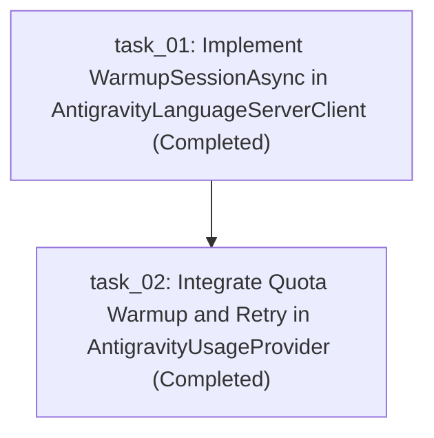

# Tasks Plan: Antigravity Quota Retrieval Warmup

## Objective
Implement session warmup via `GetUserStatus` in `AntigravityLanguageServerClient` and integrate automatic retry on empty quota in `AntigravityUsageProvider`.

## Tasks DAG

## Inventory
- `task_01.md`: [Completed] Add `WarmupSessionAsync` to `AntigravityLanguageServerClient` with candidate port iteration and unit tests.
- `task_02.md`: [Completed] Update `AntigravityUsageProvider.TryGetLanguageServerSnapshotAsync` to invoke warmup and retry on empty quota with unit tests.
