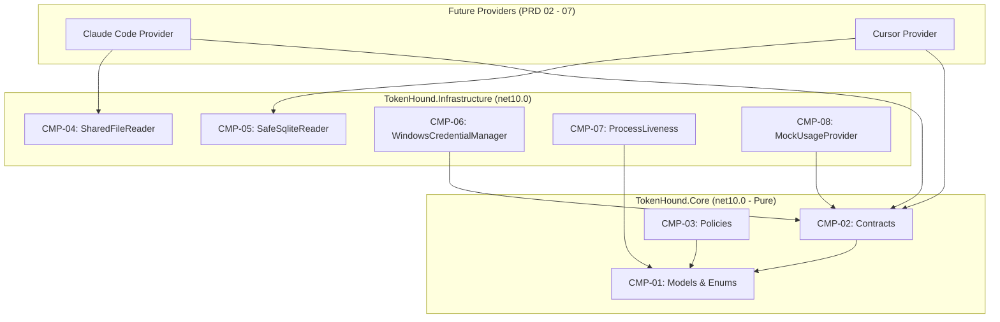

# TechSpec — Core Domain Models, Contracts, and Infrastructure Primitives

## Sources and traceability

- PRD: [tasks/prd-core-foundation/prd.md](file:///D:/MyProjects/Ideas/TokenHound/tasks/prd-core-foundation/prd.md)
- Architecture: [ARCHITECTURE.md](file:///D:/MyProjects/Ideas/TokenHound/ARCHITECTURE.md)
- Domain Context: [CONTEXT.md](file:///D:/MyProjects/Ideas/TokenHound/CONTEXT.md)
- ADR: [docs/adr/0001-tracer-bullet-and-provider-swarm.md](file:///D:/MyProjects/Ideas/TokenHound/docs/adr/0001-tracer-bullet-and-provider-swarm.md)
- Applicable Instructions: [AGENTS.md](file:///D:/MyProjects/Ideas/TokenHound/AGENTS.md)
- Specifications: [docs/specs/01-READING-STRATEGY-RESILIENCE.md](file:///D:/MyProjects/Ideas/TokenHound/docs/specs/01-READING-STRATEGY-RESILIENCE.md), [docs/specs/02-WINDOWS-CREDENTIALS-SECURITY.md](file:///D:/MyProjects/Ideas/TokenHound/docs/specs/02-WINDOWS-CREDENTIALS-SECURITY.md)

## Solution summary

This specification defines the implementation of the core domain layer (`TokenHound.Core`) and foundation infrastructure primitives (`TokenHound.Infrastructure`). `TokenHound.Core` remains a pure, platform-independent class library (`net10.0`) containing immutable records, system interfaces, and resilience policies with zero OS dependencies.

`TokenHound.Infrastructure` implements the reusable primitives required by all provider adapters: non-locking concurrent SQLite WAL reader (`SafeSqliteReader`), non-blocking shared file reader (`SharedFileReader`), Windows Credential Manager P/Invoke (`WindowsCredentialManager`), process liveness verification with PID recycling protection (`ProcessLiveness`), and a deterministic `MockUsageProvider` for offline development and UI verification.

## Technical decisions

| ID | PRD obligations | Decision | Reason and evidence | Alternatives and trade-offs |
| --- | --- | --- | --- | --- |
| DEC-01 | FR-01, FR-02, NFR-01, NFR-02 | Model domain entities (`Snapshot`, `LimitWindow`, `UsageBlock`, `AgentSession`) as sealed C# records with `init` and `required` properties. | Eliminates mutable state bug classes, guarantees thread safety across async polling loops, and complies with `AGENTS.md`. | Mutable classes (rejected: high risk of data races across threads). |
| DEC-02 | FR-02 | Strictly enforce `UsedFraction = null` when a provider does not provide a maximum quota limit. | Comports with the "Zero Fake Data" policy documented in `ARCHITECTURE.md` and `docs/specs/01-READING-STRATEGY-RESILIENCE.md`. | Synthesizing a 0% or 100% denominator (rejected: misleading to developers). |
| DEC-03 | FR-03, NFR-04 | Abstract provider interactions behind pure asynchronous interfaces (`IUsageProvider`, `IActivityMonitor`, `ICredentialStore`) accepting `CancellationToken` and returning `ValueTask<T>`. | Standardizes telemetry ingestion, supports cooperative cancellation, and eliminates allocation overhead on hot paths. | Generic event aggregator (rejected: unnecessary complexity for polling cadence). |
| DEC-04 | FR-04, FR-05, FR-06 | Implement resilience policies (`BackoffCalculator`, `RateLimitPolicy`, `RefreshSchedulePolicy`) as pure, stateless static or domain services. | Makes policy evaluation deterministic, highly performant, and 100% unit-testable in memory without timers or clocks. | Embedding timers inside policies (rejected: difficult to test without flaky delays). |
| DEC-05 | FR-07, OBJ-02 | Implement `SafeSqliteReader` using `Microsoft.Data.Sqlite` with `Mode=ReadOnly` and fallback to `immutable=1` when `-shm` sidecar is missing. | Prevents locking active SQLite databases used by Cursor or Codex CLI during developer sessions. | System.Data.SQLite (rejected: legacy native bindings; Microsoft.Data.Sqlite is modern and pure .NET). |
| DEC-06 | FR-08 | Implement `SharedFileReader` using `FileStream` configured with `FileShare.ReadWrite | FileShare.Delete`. | Guarantees non-intrusive reads of session files and OAuth credentials while parent CLI processes write or cycle them. | `File.ReadAllTextAsync` (rejected: defaults to `FileShare.Read`, which locks files against concurrent deletion or writing). |
| DEC-07 | FR-09, NFR-03 | Implement `WindowsCredentialManager` using `advapi32.dll` source-generated P/Invoke (`[LibraryImport]`) with safe `CredFree` memory disposal. | Reads Windows Credential Manager entries (e.g. `gemini:antigravity`) with zero external DLLs and zero interactive UI popups. | External credential CLI or PowerShell wrapper (rejected: excessive process overhead and token latency). |
| DEC-08 | FR-10 | Implement `ProcessLiveness` validating both OS PID presence and process `StartTimeUtc`. | Windows recycles PIDs aggressively; comparing start times ensures a dead agent session is not attributed to a new, unrelated process. | Checking only `Process.GetProcessById()` (rejected: false positives on PID recycling). |
| DEC-09 | FR-11, OBJ-04 | Implement `MockUsageProvider` capable of serving pre-baked snapshot fixtures and configurable statuses. | Decouples HUD development and CI testing from live paid developer subscriptions and external network access. | Mocking only inside test assemblies (rejected: prevents running the WPF application visually in dev mode). |

## Components and flow

| ID | Component | New or modified | Responsibility | Dependencies |
| --- | --- | --- | --- | --- |
| CMP-01 | `src/TokenHound.Core/Models/` | New | Defines `Snapshot`, `LimitWindow`, `UsageBlock`, `AgentSession`, `ProviderStatus`, `Fidelity`, `AgentSessionState`. | None (Pure .NET BCL) |
| CMP-02 | `src/TokenHound.Core/Contracts/` | New | Defines `IUsageProvider`, `IActivityMonitor`, `ICredentialStore`. | CMP-01 |
| CMP-03 | `src/TokenHound.Core/Policies/` | New | Pure algorithms: `BackoffCalculator`, `RateLimitPolicy`, `RefreshSchedulePolicy`. | CMP-01 |
| CMP-04 | `src/TokenHound.Infrastructure/Storage/SharedFileReader.cs` | New | Non-blocking file reading with `FileShare.ReadWrite \| FileShare.Delete`. | Pure BCL |
| CMP-05 | `src/TokenHound.Infrastructure/Storage/SafeSqliteReader.cs` | New | Concurrent read-only SQLite reader with WAL and immutable fallback. | Microsoft.Data.Sqlite |
| CMP-06 | `src/TokenHound.Infrastructure/Security/WindowsCredentialManager.cs` | New | P/Invoke wrapper for `advapi32.dll` (`CredReadW`, `CredFree`). | CMP-02 |
| CMP-07 | `src/TokenHound.Infrastructure/System/ProcessLiveness.cs` | New | PID validation and process start-time verification. | CMP-01 |
| CMP-08 | `src/TokenHound.Infrastructure/Providers/Mock/MockUsageProvider.cs` | New | Configurable offline provider implementing `IUsageProvider`. | CMP-01, CMP-02 |
| CMP-09 | `src/TokenHound.Infrastructure/TokenHound.Infrastructure.csproj` | Modified | Add package references for `Microsoft.Data.Sqlite` (10.0.0+) and `System.Security.Cryptography.ProtectedData`. | NuGet |



## Contracts and data

### Domain Models (`TokenHound.Core.Models`)

```csharp
namespace TokenHound.Core.Models;

public enum ProviderStatus
{
    Ok,
    Stale,
    NeedsAuth,
    AccessDenied,
    RateLimited
}

public enum Fidelity
{
    Official,
    Derived,
    Manual
}

public enum AgentSessionState
{
    Idle,
    Busy,
    Waiting
}

public sealed record LimitWindow
{
    public required string Name { get; init; }
    public double? UsedFraction { get; init; }
    public long? RemainingUnits { get; init; }
    public long? TotalUnits { get; init; }
    public DateTimeOffset? ResetTimeUtc { get; init; }
    public TimeSpan? Period { get; init; }
}

public sealed record UsageBlock
{
    public required string Reason { get; init; }
    public required bool IsBlocked { get; init; }
    public DateTimeOffset? ResetTimeUtc { get; init; }
    public int? RetryAfterSeconds { get; init; }
}

public sealed record Snapshot
{
    public required string ProviderId { get; init; }
    public required ProviderStatus Status { get; init; }
    public required Fidelity Fidelity { get; init; }
    public required DateTimeOffset FetchedAtUtc { get; init; }
    public required IReadOnlyList<LimitWindow> LimitWindows { get; init; }
    public UsageBlock? ActiveBlock { get; init; }
    public string? ErrorDescription { get; init; }
}

public sealed record AgentSession
{
    public required int Pid { get; init; }
    public required DateTimeOffset StartTimeUtc { get; init; }
    public required AgentSessionState State { get; init; }
    public required DateTimeOffset LastActivityUtc { get; init; }
}
```

### Domain Contracts (`TokenHound.Core.Contracts`)

```csharp
namespace TokenHound.Core.Contracts;

public interface IUsageProvider
{
    string ProviderId { get; }
    ValueTask<Snapshot> GetSnapshotAsync(CancellationToken cancellationToken = default);
}

public interface IActivityMonitor
{
    string ProviderId { get; }
    ValueTask<AgentSession?> CheckLivenessAsync(CancellationToken cancellationToken = default);
}

public interface ICredentialStore
{
    ValueTask<string?> ReadCredentialAsync(string target, CancellationToken cancellationToken = default);
}
```

## Integrations and interfaces

- **Windows Credential Manager**: Target `gemini:antigravity` via Win32 `CredReadW` / `CredFree`. Non-interactive, non-prompting.
- **SQLite Databases**: Read-only access to WAL files (`Mode=ReadOnly;Cache=Shared`). Falls back to `Mode=ReadOnly;immutable=1` when `-shm` sidecar is missing.
- **Local JSON / Session Files**: Stream read via `SharedFileReader` using `FileShare.ReadWrite | FileShare.Delete`.
- **Operating System Processes**: Inspection of Windows process metadata (`Process.GetProcessById`) comparing creation timestamps.

## Errors, security, and recovery

- **Zero Credential Leakage**: Raw credentials extracted via `WindowsCredentialManager` or `SharedFileReader` are treated as sensitive ephemeral strings. They are never written to disk, logger parameters, or snapshot telemetry.
- **File Concurrency Handling**: `SafeSqliteReader` intercepts `SqliteException` (error code 5: `SQLITE_BUSY` or locked) and retries up to 3 times with exponential backoff before failing gracefully.
- **Rate Limit Persistence**: `RateLimitPolicy` calculates unexpired deadlines. If the remote endpoint returns `Retry-After: 0`, the policy enforces a 60-second floor.
- **PID Recycling**: `ProcessLiveness` returns `false` if `Process.GetProcessById(pid)` throws `ArgumentException` (process dead) or if the process start time differs from the recorded session start time by more than 1 second.

## Sequencing

| Step | Depends on | Verifiable result |
| --- | --- | --- |
| 1. Define Core Models & Enums (`CMP-01`) | — | `TokenHound.Core` compiles with immutable records; unit tests verify immutability and JSON roundtrip. |
| 2. Define Core Contracts (`CMP-02`) | Step 1 | Interfaces compile and are exported with file-scoped namespaces. |
| 3. Implement Policies (`CMP-03`) | Step 1 | `BackoffCalculator`, `RateLimitPolicy`, `RefreshSchedulePolicy` pass 100% unit tests. |
| 4. Update Infrastructure Dependencies (`CMP-09`) | — | `TokenHound.Infrastructure.csproj` adds `Microsoft.Data.Sqlite`. |
| 5. Implement `SharedFileReader` (`CMP-04`) | Step 4 | Integration test reads concurrently written files without throwing `IOException`. |
| 6. Implement `SafeSqliteReader` (`CMP-05`) | Step 4 | Integration test reads test WAL SQLite DB while external writer commits. |
| 7. Implement `WindowsCredentialManager` (`CMP-06`) | Step 2 | Unit test with fake/real target returns null safely or retrieves stored credential. |
| 8. Implement `ProcessLiveness` (`CMP-07`) | Step 1 | Unit tests verify current process PID liveness and detect stale PID start times. |
| 9. Implement `MockUsageProvider` (`CMP-08`) | Step 1, 2 | Returns simulated snapshots across all states (`Ok`, `Warning`, `RateLimited`, `NeedsAuth`). |

## Test approach

- Profile:
  - Stack: .NET 10 (`net10.0`)
  - Test Projects: `tests/TokenHound.Core.Tests/TokenHound.Core.Tests.csproj`, `tests/TokenHound.Infrastructure.Tests/TokenHound.Infrastructure.Tests.csproj`
  - Runner: Microsoft.Testing.Platform (MTP) with `xunit.v3.mtp-v2`
  - Assertions: `AwesomeAssertions`
  - Mocks: `NSubstitute`
- E2E: Omitted by .NET desktop policy.
- Command prerequisites: Execute with `rtk` wrapper and enforce `--minimum-expected-tests 1`.

| ID | Obligations | Level | Scenario | Expected result | Command or project |
| --- | --- | --- | --- | --- | --- |
| TC-01 | FR-01, FR-02 | Unit | Create `LimitWindow` with null and non-null denominators | `UsedFraction` remains null when total is null; record values are immutable | `rtk dotnet test tests/TokenHound.Core.Tests -- --filter-class "*LimitWindowTests*"` |
| TC-02 | FR-04 | Unit | Calculate backoff across 5 consecutive failures | Intervals increase exponentially with jitter, respecting 60s minimum floor | `rtk dotnet test tests/TokenHound.Core.Tests -- --filter-class "*BackoffCalculatorTests*"` |
| TC-03 | FR-05 | Unit | Evaluate dispatch eligibility against rate-limit deadline | Returns false before deadline; returns true after deadline; floors `Retry-After: 0` to 60s | `rtk dotnet test tests/TokenHound.Core.Tests -- --filter-class "*RateLimitPolicyTests*"` |
| TC-04 | FR-06 | Unit | Evaluate `RefreshSchedulePolicy` under busy and idle states | Returns true when any agent busy; returns true when idle interval exceeded; false otherwise | `rtk dotnet test tests/TokenHound.Core.Tests -- --filter-class "*RefreshSchedulePolicyTests*"` |
| TC-05 | FR-08 | Integration | Read file locked by concurrent stream with `FileShare.ReadWrite \| FileShare.Delete` | `SharedFileReader` reads text without `IOException` or sharing violation | `rtk dotnet test tests/TokenHound.Infrastructure.Tests -- --filter-class "*SharedFileReaderTests*"` |
| TC-06 | FR-07, OBJ-02 | Integration | Read SQLite WAL database under active concurrent write transaction | `SafeSqliteReader` executes query without `database is locked` error | `rtk dotnet test tests/TokenHound.Infrastructure.Tests -- --filter-class "*SafeSqliteReaderTests*"` |
| TC-07 | FR-10 | Unit | Validate liveness against active process and mismatched start timestamp | Current PID succeeds; mismatched start timestamp or non-existent PID returns false | `rtk dotnet test tests/TokenHound.Infrastructure.Tests -- --filter-class "*ProcessLivenessTests*"` |
| TC-08 | FR-11, OBJ-04 | Unit | Query `MockUsageProvider` configured with varying states | Returns correct snapshot matching configured scenario without network calls | `rtk dotnet test tests/TokenHound.Infrastructure.Tests -- --filter-class "*MockUsageProviderTests*"` |

## Observability and rollout

- Signals: Structured logging using typed arguments (`Microsoft.Extensions.Logging.ILogger`) in infrastructure components.
- Rollout: PRD 01 establishes foundational assemblies referenced by subsequent PRD branches.
- Migration: Greenfield; replaces initial smoke test placeholders.

## Risks and open items

- Risk: Win32 `CredReadW` P/Invoke behavior on non-Windows dev environments (e.g. Linux CI containers).
  - Mitigation: Wrap native call behind OS check (`OperatingSystem.IsWindows()`) returning null gracefully on non-Windows platforms.
- Open item: None. All architectural decisions settled during grilling phase.

## Relevant files

- Modify: `src/TokenHound.Infrastructure/TokenHound.Infrastructure.csproj`
- Create:
  - `src/TokenHound.Core/Models/Snapshot.cs`
  - `src/TokenHound.Core/Models/LimitWindow.cs`
  - `src/TokenHound.Core/Models/UsageBlock.cs`
  - `src/TokenHound.Core/Models/ProviderStatus.cs`
  - `src/TokenHound.Core/Models/Fidelity.cs`
  - `src/TokenHound.Core/Models/AgentSession.cs`
  - `src/TokenHound.Core/Contracts/IUsageProvider.cs`
  - `src/TokenHound.Core/Contracts/IActivityMonitor.cs`
  - `src/TokenHound.Core/Contracts/ICredentialStore.cs`
  - `src/TokenHound.Core/Policies/BackoffCalculator.cs`
  - `src/TokenHound.Core/Policies/RateLimitPolicy.cs`
  - `src/TokenHound.Core/Policies/RefreshSchedulePolicy.cs`
  - `src/TokenHound.Infrastructure/Storage/SharedFileReader.cs`
  - `src/TokenHound.Infrastructure/Storage/SafeSqliteReader.cs`
  - `src/TokenHound.Infrastructure/Security/WindowsCredentialManager.cs`
  - `src/TokenHound.Infrastructure/System/ProcessLiveness.cs`
  - `src/TokenHound.Infrastructure/Providers/Mock/MockUsageProvider.cs`
