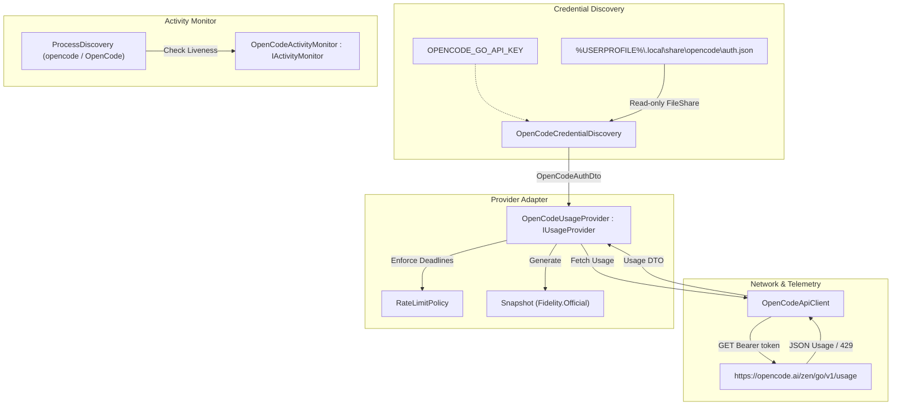

# TechSpec — OpenCode Provider Integration

## Sources and traceability

- PRD: [prd.md](file:///D:/MyProjects/TokenHound/tasks/prd-provider-opencode/prd.md)
- Provider Spec: [12-PROVIDER-OPENCODE.md](file:///D:/MyProjects/TokenHound/docs/specs/12-PROVIDER-OPENCODE.md)
- Repository constraints: [AGENTS.md](file:///D:/MyProjects/TokenHound/AGENTS.md) (Pure `TokenHound.Core`, Borrow-Don't-Own, never invent limits, `SafeSqliteReader`, MTP validation).
- Architecture context: [ARCHITECTURE.md](file:///D:/MyProjects/TokenHound/ARCHITECTURE.md) (Provider hierarchy, Clean Architecture, .NET 10).
- Existing provider references:
  - [CursorUsageProvider.cs](file:///D:/MyProjects/TokenHound/src/TokenHound.Infrastructure/Providers/Cursor/CursorUsageProvider.cs)
  - [ClaudeOAuthProvider.cs](file:///D:/MyProjects/TokenHound/src/TokenHound.Infrastructure/Providers/Claude/ClaudeOAuthProvider.cs)
  - [RateLimitPolicy.cs](file:///D:/MyProjects/TokenHound/src/TokenHound.Core/Policies/RateLimitPolicy.cs)

---

## Solution summary

Implement the `opencode` provider adapter in `TokenHound.Infrastructure` following the established provider architecture. 

The integration extracts the developer's OpenCode Go API key from `%USERPROFILE%\.local\share\opencode\auth.json` in read-only mode (`FileShare.ReadWrite | FileShare.Delete`), queries the official telemetry endpoint `https://opencode.ai/zen/go/v1/usage`, maps three authoritative limit windows (5-Hour Rolling, Weekly, Monthly) into an immutable `Snapshot`, and monitors agent execution via `opencode` / `OpenCode` process discovery.

---

## Technical decisions

| ID | PRD obligations | Decision | Reason and evidence | Alternatives and trade-offs |
| --- | --- | --- | --- | --- |
| DEC-01 | FR-01, FR-02, NFR-03 | Borrow API key directly from `%USERPROFILE%\.local\share\opencode\auth.json` with fallback to `OPENCODE_GO_API_KEY` / `OPENCODE_API_KEY`. | OpenCode CLI/TUI stores credentials in JSON format under the XDG data home on Windows. Adheres to *Borrow-Don't-Own*. | Storing a duplicate key in TokenHound requires user onboarding; DPAPI/Credential Manager is not used by OpenCode. |
| DEC-02 | FR-03, FR-04, NFR-02 | Map `https://opencode.ai/zen/go/v1/usage` to 3 distinct `LimitWindow` items with `Fidelity.Official`. | The Go endpoint provides authoritative `percent` and `resetsAt` ISO timestamps for rolling (5h), weekly, and monthly windows. | Pay-as-you-go Zen has no public usage endpoint; Go usage API is fully verified and stable. |
| DEC-03 | FR-05, NFR-04 | Enforce `RateLimitPolicy` when receiving HTTP 429 or `status: "rate-limited"`. | Respects `Retry-After` header and persists backoff deadline across polling cycles, preventing client hammering. | Naive retries risk account throttling; ignoring 429 causes stale or incorrect UI. |
| DEC-04 | FR-06 | Implement `OpenCodeActivityMonitor : IActivityMonitor` using `ProcessDiscovery` for `opencode` and `OpenCode`. | Provides real-time liveness state on HUD without polling SQLite continuously or injecting hooks. | Polling `opencode.db` frequently consumes disk I/O; process discovery is lightweight and sufficient. |
| DEC-05 | NFR-01, NFR-05 | Encapsulate HTTP transport in `OpenCodeApiClient` accepting `HttpMessageHandler` in constructor. | Ensures 100% unit-testability in memory without hitting live endpoints during test execution. | Using static `HttpClient` prevents deterministic test mocking. |

---

## Components and flow



### Components inventory

| ID | Component | New or modified | Responsibility | Dependencies |
| --- | --- | --- | --- | --- |
| CMP-01 | `src/TokenHound.Infrastructure/Providers/OpenCode/OpenCodeAuthDto.cs` | New | Immutable record representing borrowed OpenCode authentication (`ApiKey`, `Source`). | None |
| CMP-02 | `src/TokenHound.Infrastructure/Providers/OpenCode/OpenCodeUsageDto.cs` | New | Strongly typed JSON DTOs for `usage.rolling`, `usage.weekly`, `usage.monthly`, and error payloads. | `System.Text.Json` |
| CMP-03 | `src/TokenHound.Infrastructure/Providers/OpenCode/OpenCodeCredentialDiscovery.cs` | New | Discovers OpenCode API key from env or `auth.json` with safe read-only file sharing. | CMP-01 |
| CMP-04 | `src/TokenHound.Infrastructure/Providers/OpenCode/OpenCodeApiClient.cs` | New | Dispatches HTTP GET to `zen/go/v1/usage`, extracts `Retry-After`, and deserializes responses. | CMP-02 |
| CMP-05 | `src/TokenHound.Infrastructure/Providers/OpenCode/OpenCodeUsageProvider.cs` | New | Implements `IUsageProvider` (`ProviderId = "opencode"`), builds `Snapshot` with 3 `LimitWindow` records. | CMP-03, CMP-04, `RateLimitPolicy` |
| CMP-06 | `src/TokenHound.Infrastructure/Providers/OpenCode/OpenCodeActivityMonitor.cs` | New | Implements `IActivityMonitor`, discovers `opencode` / `OpenCode` process liveness. | `ProcessDiscovery`, `ProcessLiveness` |
| CMP-07 | `src/TokenHound.App/appsettings.json` | Modified | Adds default entry for `"OpenCode": { "Enabled": true }`. | None |

---

## Contracts and data

### `OpenCodeUsageResponse` (JSON DTO)

```csharp
public sealed record OpenCodeUsageResponse
{
    [JsonPropertyName("usage")]
    public required OpenCodeUsageData Usage { get; init; }
}

public sealed record OpenCodeUsageData
{
    [JsonPropertyName("rolling")]
    public required OpenCodeLimitWindowDto Rolling { get; init; }

    [JsonPropertyName("weekly")]
    public required OpenCodeLimitWindowDto Weekly { get; init; }

    [JsonPropertyName("monthly")]
    public required OpenCodeLimitWindowDto Monthly { get; init; }
}

public sealed record OpenCodeLimitWindowDto
{
    [JsonPropertyName("status")]
    public required string Status { get; init; }

    [JsonPropertyName("percent")]
    public required double Percent { get; init; }

    [JsonPropertyName("resetsAt")]
    public required DateTimeOffset ResetsAt { get; init; }
}
```

### `Snapshot` Mapping Rules

```csharp
var windows = new List<LimitWindow>
{
    new()
    {
        Name = "5-Hour Rolling",
        GroupName = "OpenCode Go",
        Period = TimeSpan.FromHours(5),
        TotalUnits = 100,
        RemainingUnits = (long)Math.Max(0, Math.Round(100.0 - usage.Rolling.Percent)),
        UsedFraction = Math.Clamp(usage.Rolling.Percent / 100.0, 0.0, 1.0),
        ResetTimeUtc = usage.Rolling.ResetsAt
    },
    new()
    {
        Name = "Weekly",
        GroupName = "OpenCode Go",
        Period = TimeSpan.FromDays(7),
        TotalUnits = 100,
        RemainingUnits = (long)Math.Max(0, Math.Round(100.0 - usage.Weekly.Percent)),
        UsedFraction = Math.Clamp(usage.Weekly.Percent / 100.0, 0.0, 1.0),
        ResetTimeUtc = usage.Weekly.ResetsAt
    },
    new()
    {
        Name = "Monthly",
        GroupName = "OpenCode Go",
        Period = TimeSpan.FromDays(30),
        TotalUnits = 100,
        RemainingUnits = (long)Math.Max(0, Math.Round(100.0 - usage.Monthly.Percent)),
        UsedFraction = Math.Clamp(usage.Monthly.Percent / 100.0, 0.0, 1.0),
        ResetTimeUtc = usage.Monthly.ResetsAt
    }
};
```

---

## Integrations and interfaces

- **Endpoint**: `https://opencode.ai/zen/go/v1/usage`
- **Method**: `GET`
- **Headers**:
  - `Authorization: Bearer <API_KEY>`
  - `User-Agent: TokenHound`
  - `Accept: application/json`
- **Timeout**: 10 seconds.
- **Local File**: `%USERPROFILE%\.local\share\opencode\auth.json` (JSON dictionary, key `opencode-go`).

---

## Errors, security, and recovery

- **Missing Credential**: Transitions to `ProviderStatus.NeedsAuth` with clear description; does not throw.
- **HTTP 401 Unauthorized**: Transitions to `ProviderStatus.NeedsAuth`.
- **HTTP 403 Forbidden / EntitlementError**: User has key but no active OpenCode Go subscription. Sets `ProviderStatus.AccessDenied` with description `"OpenCode Go subscription required"`.
- **HTTP 429 Rate Limited**:
  - Parses `Retry-After` header (seconds).
  - Falls back to `resetsAt` timestamp of the rolling window.
  - Sets `Snapshot.ActiveBlock = new UsageBlock { Reason = BlockedReason.RateLimitReached, BlockedUntilUtc = deadline }`.
  - Calculates backoff using `RateLimitPolicy.ComputeBackoffFloor`.
- **Network / Socket Errors**: Returns `ProviderStatus.Stale` if previous snapshot exists, otherwise `ProviderStatus.Error`.
- **Process Termination**: Liveness returns `null` or `AgentSessionState.Idle` safely without lingering locks.

---

## Sequencing

| Step | Depends on | Verifiable result |
| --- | --- | --- |
| 1. Create DTOs & Credential Discovery | — | Unit tests verify JSON extraction from mock `auth.json` and env overrides. |
| 2. Implement `OpenCodeApiClient` | Step 1 | Unit tests with `MockHttpMessageHandler` verify 200, 401, 403, and 429 responses. |
| 3. Implement `OpenCodeUsageProvider` | Step 2 | Snapshots return 3 valid `LimitWindow` instances with correct `Fidelity.Official`. |
| 4. Implement `OpenCodeActivityMonitor` | — | Unit tests verify process discovery for `opencode` and `OpenCode`. |
| 5. Register in DI and Configuration | Steps 3, 4 | Provider appears in `UsageStore` and settings schemas. |

---

## Test approach

- **Profile**: .NET 10 (`net10.0`), Microsoft.Testing.Platform (MTP), `TokenHound.Infrastructure.Tests`.
- **E2E**: Omitted by desktop .NET policy.
- **Runner flags**: `rtk dotnet test --project tests/TokenHound.Infrastructure.Tests --no-build --no-restore -- --minimum-expected-tests 1`.

| ID | Obligations | Level | Scenario | Expected result | Command or project |
| --- | --- | --- | --- | --- | --- |
| TC-01 | FR-01, FR-02 | Unit | Discover key from `auth.json` and env | Key parsed correctly; missing file returns null | `TokenHound.Infrastructure.Tests` |
| TC-02 | FR-03, FR-04 | Unit | Parse successful 3-window usage response | 3 `LimitWindow` records generated with accurate `UsedFraction` | `TokenHound.Infrastructure.Tests` |
| TC-03 | FR-05 | Unit | API returns HTTP 429 with `Retry-After` | `ActiveBlock` created and backoff deadline set | `TokenHound.Infrastructure.Tests` |
| TC-04 | FR-07 | Unit | HTTP 401 and 403 handling | Maps to `NeedsAuth` and `AccessDenied` | `TokenHound.Infrastructure.Tests` |
| TC-05 | FR-06 | Unit | Process liveness check | Detects running agent process | `TokenHound.Infrastructure.Tests` |

---

## Observability and rollout

- **Logging**: Structured logs with typed arguments (`"Fetching OpenCode usage telemetry"`, `"OpenCode rate-limited until {BlockedUntilUtc}"`).
- **Rollout**: Added to default disabled/enabled provider list in configuration.
- **Compatibility**: Completely additive; zero breaking changes to existing providers or core models.

---

## Risks and open items

- **Risk**: OpenCode alters `zen/go/v1/usage` response schema in future releases.
  - *Mitigation*: Defensive deserialization with `System.Text.Json`, graceful fallback to `ProviderStatus.Error` rather than unhandled exception.
- **Risk**: Developer only uses pay-as-you-go OpenCode Zen (without Go subscription).
  - *Mitigation*: API returns 403 `EntitlementError`; TokenHound informs the user that OpenCode Go subscription is required for API quota monitoring.

---

## Relevant files

- Create: `src/TokenHound.Infrastructure/Providers/OpenCode/OpenCodeAuthDto.cs`
- Create: `src/TokenHound.Infrastructure/Providers/OpenCode/OpenCodeUsageDto.cs`
- Create: `src/TokenHound.Infrastructure/Providers/OpenCode/OpenCodeCredentialDiscovery.cs`
- Create: `src/TokenHound.Infrastructure/Providers/OpenCode/OpenCodeApiClient.cs`
- Create: `src/TokenHound.Infrastructure/Providers/OpenCode/OpenCodeUsageProvider.cs`
- Create: `src/TokenHound.Infrastructure/Providers/OpenCode/OpenCodeActivityMonitor.cs`
- Create: `tests/TokenHound.Infrastructure.Tests/Providers/OpenCode/OpenCodeCredentialDiscoveryTests.cs`
- Create: `tests/TokenHound.Infrastructure.Tests/Providers/OpenCode/OpenCodeApiClientTests.cs`
- Create: `tests/TokenHound.Infrastructure.Tests/Providers/OpenCode/OpenCodeUsageProviderTests.cs`
- Modify: `src/TokenHound.App/appsettings.json`
- Modify: `src/TokenHound.Infrastructure/Configuration/UserSettings.cs` (if provider list is enumerated)
