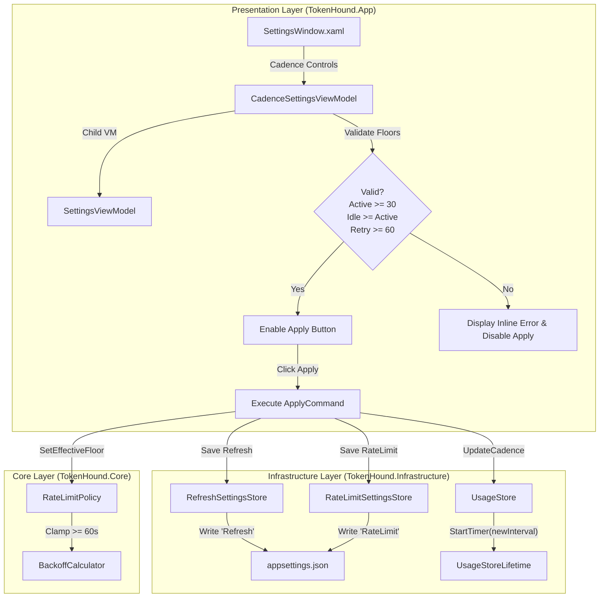

# TechSpec — Polling Cadence and Rate-Limit Retry Configuration in Settings

## Sources and traceability

- PRD: [prd.md](file:///D:/MyProjects/TokenHound/tasks/prd-settings-02-cadence-and-retries/prd.md), read September 7, 2026. This is a new TechSpec for slice `settings-02-cadence-and-retries`.
- Repository constraints: [AGENTS.md](file:///D:/MyProjects/TokenHound/AGENTS.md), [ARCHITECTURE.md](file:///D:/MyProjects/TokenHound/ARCHITECTURE.md), and global RTK command rules.
- Sibling TechSpec: [tasks/prd-settings-01-provider-management/techspec.md](file:///D:/MyProjects/TokenHound/tasks/prd-settings-01-provider-management/techspec.md) (host Settings dialog layout, `SettingsViewModel`, and persistence framework).
- Skills: `sdd-create-techspec` and its .NET profile reference (`references/dotnet.md`), `repository-cli-efficiency`, and `dotnet-efficient-validation`.
- Engine and configuration evidence:
  - [RefreshSettings.cs](file:///D:/MyProjects/TokenHound/src/TokenHound.Infrastructure/Configuration/RefreshSettings.cs) (`ActiveIntervalSeconds`, `IdleIntervalSeconds`, and `MINIMUM_INTERVAL_SECONDS = 30`).
  - [RefreshSettingsStore.cs](file:///D:/MyProjects/TokenHound/src/TokenHound.Infrastructure/Configuration/RefreshSettingsStore.cs) (reads `"Refresh"` block from `appsettings.json`; currently lacks save capabilities).
  - [HudPositionStore.cs](file:///D:/MyProjects/TokenHound/src/TokenHound.Infrastructure/Configuration/HudPositionStore.cs) (established JSON DOM node read/write pattern preserving sibling sections).
  - [UsageStore.cs](file:///D:/MyProjects/TokenHound/src/TokenHound.Infrastructure/Engine/UsageStore.cs) and [UsageStoreLifetime.cs](file:///D:/MyProjects/TokenHound/src/TokenHound.Infrastructure/Engine/UsageStoreLifetime.cs) (`StartTimer`, `StopTimer`, and periodic timer loop).
  - [appsettings.json](file:///D:/MyProjects/TokenHound/src/TokenHound.App/appsettings.json) (active configuration file with `Hud`, `Refresh`, `Providers`, and `Log` sections).
- Core policy evidence:
  - [RateLimitPolicy.cs](file:///D:/MyProjects/TokenHound/src/TokenHound.Core/Policies/RateLimitPolicy.cs) (`MINIMUM_RETRY_FLOOR = 60s`, `CanDispatch`, and `CalculateDeadline`).
  - [BackoffCalculator.cs](file:///D:/MyProjects/TokenHound/src/TokenHound.Core/Policies/BackoffCalculator.cs) (`Floor = 60s`, `Ceiling = 3600s`).
  - [RefreshSchedulePolicy.cs](file:///D:/MyProjects/TokenHound/src/TokenHound.Core/Policies/RefreshSchedulePolicy.cs) (`DEFAULT_ACTIVE_INTERVAL = 180s`, `DEFAULT_IDLE_INTERVAL = 300s`).

## Solution summary

Extend the [SettingsWindow](file:///D:/MyProjects/TokenHound/src/TokenHound.App/UI/Windows/SettingsWindow.xaml) established in slice 01 with a dedicated "Cadence & Rate Limits" configuration section. Users can inspect and adjust the active polling interval, idle polling interval, and HTTP 429 minimum retry floor. All inputs enforce strict inviolable safety floors (`MINIMUM_INTERVAL_SECONDS = 30s` and `MINIMUM_RETRY_FLOOR = 60s`) with real-time inline validation, relational checks (`IdleInterval >= ActiveInterval`), and an instant "Reset to Defaults" action.

Settings are persisted to [appsettings.json](file:///D:/MyProjects/TokenHound/src/TokenHound.App/appsettings.json) under the `"Refresh"` and `"RateLimit"` sections using the non-destructive JSON DOM pattern, preserving all sibling sections. Valid edits apply immediately at runtime to [UsageStore.cs](file:///D:/MyProjects/TokenHound/src/TokenHound.Infrastructure/Engine/UsageStore.cs) (reconfiguring the periodic timer and idle cadence via `UsageStoreLifetime`) and [RateLimitPolicy.cs](file:///D:/MyProjects/TokenHound/src/TokenHound.Core/Policies/RateLimitPolicy.cs) without requiring an application restart.

## Technical decisions

| ID | PRD obligations | Decision | Reason and evidence | Alternatives and trade-offs |
| --- | --- | --- | --- | --- |
| DEC-01 | FR-01, FR-06, FR-11, NFR-03 | Encapsulate cadence and retry presentation in a testable `CadenceSettingsViewModel` integrated into `SettingsViewModel`. Support cancellation/discard on window dismiss. | Separates numeric parsing, validation state, and dirty tracking from the provider toggle logic in slice 01, keeping ViewModels unit-testable in memory without opening WPF windows. | Putting all cadence properties into the main `SettingsViewModel` would cause the class to exceed 300 lines (violating AGENTS.md). |
| DEC-02 | FR-02, FR-03, FR-04, FR-05, NFR-02 | Validate safety floors (`>= 30s` for cadence, `>= 60s` for 429 retry floor, and `Idle >= Active`) immediately on input property changes, gating the Save/Apply button. | Guards against API hammering, account throttling, and invalid configurations before any disk write or engine update occurs. | Validating only on Save would delay feedback and allow users to submit invalid states. |
| DEC-03 | FR-08, NFR-04 | Add `Save(RefreshSettings)` to [RefreshSettingsStore.cs](file:///D:/MyProjects/TokenHound/src/TokenHound.Infrastructure/Configuration/RefreshSettingsStore.cs) and introduce `RateLimitSettingsStore.cs` using the non-destructive JSON DOM manipulation pattern. | Follows the proven [HudPositionStore.cs](file:///D:/MyProjects/TokenHound/src/TokenHound.Infrastructure/Configuration/HudPositionStore.cs) approach: preserves comments, formatting, and sibling sections (`Hud`, `Providers`, `Log`). | Using a monolithic settings binder would overwrite JSON comments and format changes. |
| DEC-04 | FR-09, OBJ-05, NFR-05 | Add `UpdateCadence(TimeSpan activeInterval, TimeSpan idleInterval)` to [UsageStore.cs](file:///D:/MyProjects/TokenHound/src/TokenHound.Infrastructure/Engine/UsageStore.cs), restarting the periodic timer safely via `UsageStoreLifetime.StartTimer`. | `UsageStoreLifetime.StartTimer` already safely cancels and drains previous timer loops without deadlocks or resource leaks. Dynamic updates take effect on the next tick without interrupting in-flight queries. | Tearing down and recreating `UsageStore` would drop provider registrations, unexpired rate-limit deadlines, and snapshot subscribers. |
| DEC-05 | FR-10, OBJ-05, NFR-01, NFR-02 | Support a thread-safe configurable effective retry floor in [RateLimitPolicy.cs](file:///D:/MyProjects/TokenHound/src/TokenHound.Core/Policies/RateLimitPolicy.cs) via `SetEffectiveFloor(TimeSpan floor)` while strictly clamping values `< MINIMUM_RETRY_FLOOR` (60s). | Keeps `TokenHound.Core` 100% pure (zero UI or OS dependencies). Enforces the inviolable 60s floor invariant even if configured or deserialized with lower numbers. | Hard-coding the floor prevents user customizability for aggressive throttling scenarios; omitting the clamp would violate repository invariants. |
| DEC-06 | FR-07, OBJ-06 | Implement a single-click "Reset to Defaults" action resetting form values to Active: 180s, Idle: 300s, and Retry Floor: 60s. | Reuses factory defaults defined in [RefreshSchedulePolicy.cs](file:///D:/MyProjects/TokenHound/src/TokenHound.Core/Policies/RefreshSchedulePolicy.cs) and [RateLimitPolicy.cs](file:///D:/MyProjects/TokenHound/src/TokenHound.Core/Policies/RateLimitPolicy.cs). | Requiring manual typing to revert settings leads to user frustration and potential typing errors. |

## Components and flow



### Components inventory

| ID | Component | State | Responsibility | Dependencies |
| --- | --- | --- | --- | --- |
| CMP-01 | `src/TokenHound.Infrastructure/Configuration/RefreshSettingsStore.cs` | Modify | Add `Save(RefreshSettings)` using JSON DOM nodes preserving sibling sections. | [RefreshSettings.cs](file:///D:/MyProjects/TokenHound/src/TokenHound.Infrastructure/Configuration/RefreshSettings.cs) |
| CMP-02 | `src/TokenHound.Infrastructure/Configuration/RateLimitSettings.cs` | Create | Immutable record for rate-limit configuration (`MinimumRetryFloorSeconds`, default 60s). | None (`Core`/`Infrastructure` pure) |
| CMP-03 | `src/TokenHound.Infrastructure/Configuration/RateLimitSettingsStore.cs` | Create | Non-destructive reader and writer for `"RateLimit"` section in `appsettings.json`. | CMP-02, [HudPositionStore.cs](file:///D:/MyProjects/TokenHound/src/TokenHound.Infrastructure/Configuration/HudPositionStore.cs) pattern |
| CMP-04 | `src/TokenHound.Core/Policies/RateLimitPolicy.cs` | Modify | Add `SetEffectiveFloor` and clamp to `MINIMUM_RETRY_FLOOR = 60s` in penalty calculations. | [BackoffCalculator.cs](file:///D:/MyProjects/TokenHound/src/TokenHound.Core/Policies/BackoffCalculator.cs) |
| CMP-05 | `src/TokenHound.Infrastructure/Engine/UsageStore.cs` | Modify | Add `UpdateCadence(TimeSpan activeInterval, TimeSpan idleInterval)` updating `_idleInterval` and restarting periodic timer via lifetime. | [UsageStoreLifetime.cs](file:///D:/MyProjects/TokenHound/src/TokenHound.Infrastructure/Engine/UsageStoreLifetime.cs) |
| CMP-06 | `src/TokenHound.App/ViewModels/CadenceSettingsViewModel.cs` | Create | Presentation model for cadence and retry inputs with real-time validation, reset defaults, and apply logic. | CMP-01, CMP-03, CMP-04, CMP-05 |
| CMP-07 | `src/TokenHound.App/ViewModels/SettingsViewModel.cs` | Modify | Compose `CadenceSettingsViewModel` as a child view model. | CMP-06 |
| CMP-08 | `src/TokenHound.App/UI/Windows/SettingsWindow.xaml` and `.xaml.cs` | Modify | Integrate Cadence & Rate Limits UI section with inputs, validation error indicators, and Reset/Apply controls. | CMP-06, CMP-07, [DialogResources.xaml](file:///D:/MyProjects/TokenHound/src/TokenHound.App/UI/Styles/DialogResources.xaml) |
| CMP-09 | `tests/TokenHound.Infrastructure.Tests/Configuration/RefreshSettingsStoreTests.cs` | Create | Unit tests verifying `RefreshSettingsStore.Save` writes valid JSON and preserves sibling sections. | CMP-01 |
| CMP-10 | `tests/TokenHound.Infrastructure.Tests/Configuration/RateLimitSettingsStoreTests.cs` | Create | Unit tests verifying `RateLimitSettingsStore` load, save, and safety clamping. | CMP-02, CMP-03 |
| CMP-11 | `tests/TokenHound.Core.Tests/Policies/RateLimitPolicyConfigTests.cs` | Create | Unit tests verifying configurable retry floor and hard clamping to 60s floor. | CMP-04 |
| CMP-12 | `tests/TokenHound.Infrastructure.Tests/Engine/UsageStoreCadenceTests.cs` | Create | Unit tests verifying `UpdateCadence` updates timer interval and idle threshold live without deadlocks. | CMP-05 |
| CMP-13 | `tests/TokenHound.Infrastructure.Tests/ViewModels/CadenceSettingsViewModelTests.cs` | Create | Headless tests verifying input validation, error messages, reset defaults, and apply behavior. | CMP-06 |

## Contracts and data

### RateLimitSettings Record

```csharp
namespace TokenHound.Infrastructure.Configuration;

/// <summary>
/// Persisted configuration for HTTP 429 rate-limit resilience parameters.
/// </summary>
public sealed record RateLimitSettings
{
    /// <summary>
    /// The hard minimum retry floor (60 seconds) guarding against API hammering.
    /// </summary>
    public const int MINIMUM_FLOOR_SECONDS = 60;

    /// <summary>
    /// Default retry floor (60 seconds).
    /// </summary>
    public const int DEFAULT_FLOOR_SECONDS = 60;

    /// <summary>
    /// Gets the configured minimum retry floor in seconds, or null for default.
    /// </summary>
    public int? MinimumRetryFloorSeconds { get; init; }

    /// <summary>
    /// Gets the resolved minimum retry floor, clamped to <see cref="MINIMUM_FLOOR_SECONDS"/>.
    /// </summary>
    public TimeSpan MinimumRetryFloor
        => TimeSpan.FromSeconds(Math.Max(MINIMUM_FLOOR_SECONDS, MinimumRetryFloorSeconds ?? DEFAULT_FLOOR_SECONDS));
}
```

### Configuration JSON Schema in `appsettings.json`

```json
{
  "Hud": {
    "Left": null,
    "Top": null
  },
  "Refresh": {
    "ActiveIntervalSeconds": 180,
    "IdleIntervalSeconds": 300
  },
  "RateLimit": {
    "MinimumRetryFloorSeconds": 60
  },
  "Providers": {
    "claude": true,
    "antigravity": true,
    "codex": true,
    "cursor": true
  },
  "Log": {
    ...
  }
}
```

## Integrations and interfaces

### UsageStore Cadence Extension

```csharp
// TokenHound.Infrastructure.Engine.UsageStore
public void UpdateCadence(TimeSpan activeInterval, TimeSpan idleInterval)
{
    ThrowIfDisposedOrStopping();

    var safeActive = activeInterval < TimeSpan.FromSeconds(RefreshSettings.MINIMUM_INTERVAL_SECONDS)
        ? TimeSpan.FromSeconds(RefreshSettings.MINIMUM_INTERVAL_SECONDS)
        : activeInterval;

    var safeIdle = idleInterval < safeActive ? safeActive : idleInterval;

    _idleInterval = safeIdle;

    if (_lifetime.IsTimerRunning)
        _lifetime.StartTimer(safeActive, TickAsync);
}
```

### RateLimitPolicy Configurable Floor Extension

```csharp
// TokenHound.Core.Policies.RateLimitPolicy
private static TimeSpan _effectiveRetryFloor = MINIMUM_RETRY_FLOOR;

public static TimeSpan EffectiveRetryFloor
    => _effectiveRetryFloor;

public static void SetEffectiveFloor(TimeSpan floor)
{
    _effectiveRetryFloor = floor < MINIMUM_RETRY_FLOOR ? MINIMUM_RETRY_FLOOR : floor;
}
```

### CadenceSettingsViewModel Interface

```csharp
public sealed class CadenceSettingsViewModel : INotifyPropertyChanged
{
    public int ActiveIntervalSeconds { get; set; }
    public int IdleIntervalSeconds { get; set; }
    public int MinimumRetryFloorSeconds { get; set; }

    public string? ActiveIntervalError { get; }
    public string? IdleIntervalError { get; }
    public string? RetryFloorError { get; }
    public bool HasErrors { get; }
    public bool IsDirty { get; }

    public void ResetToDefaults();
    public void Apply();
    public void Discard();
}
```

## Errors, security, and recovery

- **Safety Floor Enforcement**: Any external edit to `appsettings.json` specifying values `< 30s` for refresh or `< 60s` for retry floor is clamped upon deserialization by `RefreshSettings.Resolve` and `RateLimitSettings.MinimumRetryFloor`. The application will never hammer APIs even with invalid config files.
- **Relational Consistency**: If a user enters an active interval of 300s and an idle interval of 60s, `IdleIntervalError` is set to `"Idle interval should not be less than active interval"`, and `HasErrors` is `true`, preventing submission.
- **Non-blocking UI**: Persisting to `appsettings.json` and calling `UpdateCadence` takes < 20ms and executes without blocking the UI thread or deadlocking with background timer ticks.
- **Discard on Cancel**: If a user enters modifications and closes Settings via Close, Esc, or title bar 'X' without clicking Apply, all edits are discarded. Reopening Settings loads the current active values.
- **Rollback**: If a write fails (e.g. disk full), an error message is displayed in the UI, existing in-memory policies remain untouched, and the configuration file is not left corrupted.

## Sequencing

| Step | Depends on | Verifiable result |
| --- | --- | --- |
| 1. Core Policy Extension | — | `RateLimitPolicy.SetEffectiveFloor` implemented and verified with pure unit tests in `TokenHound.Core.Tests`. |
| 2. Persistence Stores | Step 1 | `RefreshSettingsStore.Save` and `RateLimitSettingsStore` implemented with unit tests in `TokenHound.Infrastructure.Tests`. |
| 3. UsageStore Runtime Cadence | Step 2 | `UsageStore.UpdateCadence` implemented and verified with tests verifying dynamic timer update. |
| 4. Presentation ViewModel | Step 3 | `CadenceSettingsViewModel` implemented with unit tests verifying validation, dirty state, reset, and apply. |
| 5. SettingsWindow UI Integration | Step 4 | Cadence & Rate Limits section added to `SettingsWindow.xaml`, connected to `CadenceSettingsViewModel`. |
| 6. Composition & Acceptance | Step 5 | `App.xaml.cs` wired to initialize rate-limit settings on startup; manual acceptance walkthrough passes. |

## Test approach

### Validation profile

- Projects: `src/TokenHound.App` (net10.0-windows, WPF), `src/TokenHound.Infrastructure` (net10.0), `src/TokenHound.Core` (net10.0).
- Test runners: Microsoft.Testing.Platform runner (`UseMicrosoftTestingPlatformRunner=true`) with `xunit.v3.mtp-v2` in `tests/TokenHound.Core.Tests` and `tests/TokenHound.Infrastructure.Tests`.
- Presentation testing strategy: Link `CadenceSettingsViewModel.cs` into `TokenHound.Infrastructure.Tests` to verify validation, error messages, and apply behavior headlessly.
- **E2E: omitted by desktop .NET policy.** Desktop UI automation is omitted per repository guidelines. Verification is achieved through unit tests, integration tests, and the manual acceptance script below.

### Test execution commands

Build and test commands must use `rtk` per global repository instructions:

```powershell
# Restore and build affected projects
rtk dotnet build src/TokenHound.App/TokenHound.App.csproj -c Release --nologo --verbosity:minimal
if ($LASTEXITCODE -ne 0) { exit $LASTEXITCODE }
rtk dotnet build tests/TokenHound.Core.Tests/TokenHound.Core.Tests.csproj -c Release --nologo --verbosity:minimal
if ($LASTEXITCODE -ne 0) { exit $LASTEXITCODE }
rtk dotnet build tests/TokenHound.Infrastructure.Tests/TokenHound.Infrastructure.Tests.csproj -c Release --nologo --verbosity:minimal
if ($LASTEXITCODE -ne 0) { exit $LASTEXITCODE }

# Run focused MTP test classes
rtk dotnet run --project tests/TokenHound.Core.Tests/TokenHound.Core.Tests.csproj --no-build --no-restore -c Release -- --minimum-expected-tests 1 --filter-class "*RateLimitPolicyConfigTests*"
if ($LASTEXITCODE -ne 0) { exit $LASTEXITCODE }
rtk dotnet run --project tests/TokenHound.Infrastructure.Tests/TokenHound.Infrastructure.Tests.csproj --no-build --no-restore -c Release -- --minimum-expected-tests 1 --filter-class "*RefreshSettingsStoreTests*"
if ($LASTEXITCODE -ne 0) { exit $LASTEXITCODE }
rtk dotnet run --project tests/TokenHound.Infrastructure.Tests/TokenHound.Infrastructure.Tests.csproj --no-build --no-restore -c Release -- --minimum-expected-tests 1 --filter-class "*RateLimitSettingsStoreTests*"
if ($LASTEXITCODE -ne 0) { exit $LASTEXITCODE }
rtk dotnet run --project tests/TokenHound.Infrastructure.Tests/TokenHound.Infrastructure.Tests.csproj --no-build --no-restore -c Release -- --minimum-expected-tests 1 --filter-class "*UsageStoreCadenceTests*"
if ($LASTEXITCODE -ne 0) { exit $LASTEXITCODE }
rtk dotnet run --project tests/TokenHound.Infrastructure.Tests/TokenHound.Infrastructure.Tests.csproj --no-build --no-restore -c Release -- --minimum-expected-tests 1 --filter-class "*CadenceSettingsViewModelTests*"
if ($LASTEXITCODE -ne 0) { exit $LASTEXITCODE }
```

### Test matrix

| ID | Obligations | Level | Scenario and expected evidence | Project/class or manual script |
| --- | --- | --- | --- | --- |
| TC-01 | FR-08, OBJ-04 | Unit | Save `RefreshSettings` to `appsettings.json`. Verify `"Refresh"` section is updated and `Hud`, `Providers`, `Log` sections remain intact. | `RefreshSettingsStoreTests` |
| TC-02 | FR-08, OBJ-04 | Unit | Save `RateLimitSettings` with `MinimumRetryFloorSeconds = 120`. Verify reload returns 120s while other sections remain intact. | `RateLimitSettingsStoreTests` |
| TC-03 | FR-05, NFR-02 | Unit | Pass 10s into `RateLimitPolicy.SetEffectiveFloor`. Verify effective floor clamps to `MINIMUM_RETRY_FLOOR` (60s). Verify penalty calculation with `Retry-After: 0` still enforces 60s floor. | `RateLimitPolicyConfigTests` |
| TC-04 | FR-09, OBJ-05, NFR-05 | Unit | Call `UsageStore.UpdateCadence(TimeSpan.FromSeconds(60), TimeSpan.FromSeconds(120))`. Verify timer ticks at 60s interval and `_idleInterval` updates without interrupting in-flight operations. | `UsageStoreCadenceTests` |
| TC-05 | FR-02, FR-03, FR-06 | Unit | Enter `15` in Active Interval in `CadenceSettingsViewModel`. Verify `ActiveIntervalError` is populated, `HasErrors` is true, and `ApplyCommand` cannot execute. | `CadenceSettingsViewModelTests` |
| TC-06 | FR-04, FR-06 | Unit | Enter Active = `300` and Idle = `180`. Verify `IdleIntervalError` indicates idle cannot be shorter than active, and Apply is disabled. | `CadenceSettingsViewModelTests` |
| TC-07 | FR-07, OBJ-06 | Unit | Edit values away from defaults, then call `ResetToDefaults()`. Verify values reset to Active: 180, Idle: 300, Retry Floor: 60, and errors clear. | `CadenceSettingsViewModelTests` |
| TC-08 | FR-11 | Unit | Edit values without applying, call `Discard()`. Verify properties revert to persisted values. | `CadenceSettingsViewModelTests` |
| TC-09 | FR-01, FR-06, MAN | Manual | Open Settings -> Cadence & Rate Limits. Verify layout, typography, and initial values. Enter invalid value (`10`), confirm red error text appears and Apply disables. Correct value, click Apply, confirm success indicator. | `MAN-01` |
| TC-10 | FR-09, MAN | Manual | Change Active Interval from 180s to 30s and click Apply. Observe application logs to verify the next polling tick fires in 30 seconds without restarting the app. | `MAN-02` |

### Manual acceptance script

- **MAN-01 (UI Validation & Apply Walkthrough)**: Launch TokenHound on desktop. Open Settings -> Cadence & Rate Limits. Verify input boxes for Active (180s), Idle (300s), and Retry Floor (60s). Change Active to `10`; verify inline validation error appears and Apply button is disabled. Change Active to `60`; verify error clears and Apply enables. Click "Reset to Defaults"; verify inputs return to 180, 300, 60.
- **MAN-02 (Live Runtime Verification)**: Change Active Interval to `35` seconds and click Apply. Inspect debug logs (`TokenHound_*.logc`) to verify the scheduler ticks every 35 seconds without restarting the app.
- **MAN-03 (Cancel / Discard Verification)**: Edit Idle Interval to `999`. Close Settings using Esc without clicking Apply. Reopen Settings; confirm Idle Interval reverted to previously persisted value.

## Observability and rollout

- **Observability**: [UsageStore.cs](file:///D:/MyProjects/TokenHound/src/TokenHound.Infrastructure/Engine/UsageStore.cs) logs `Information` when cadence is updated: `"Polling cadence updated: active {ActiveInterval}, idle {IdleInterval}"`. [RateLimitPolicy.cs](file:///D:/MyProjects/TokenHound/src/TokenHound.Core/Policies/RateLimitPolicy.cs) logs when retry floor changes.
- **Migration & Compatibility**: If `"RateLimit"` is missing in existing `appsettings.json`, it defaults to `MinimumRetryFloorSeconds = 60`. If `"Refresh"` is missing, it defaults to Active: 180, Idle: 300. Fully backward compatible.
- **Rollback**: Reverting commits leaves `appsettings.json` intact, as unknown JSON sections are ignored by older versions.

## Risks and open items

- **Risk 1: Accidental Rapid Refresh**: A user might configure 30 seconds for both active and idle intervals, increasing quota usage.
  - *Mitigation*: The 30s hard floor prevents abuse, and inline helper text explains the impact of each setting.
- **Open Items**: None.

## Relevant files

- Modify:
  - `src/TokenHound.Core/Policies/RateLimitPolicy.cs`
  - `src/TokenHound.Infrastructure/Configuration/RefreshSettingsStore.cs`
  - `src/TokenHound.Infrastructure/Engine/UsageStore.cs`
  - `src/TokenHound.App/ViewModels/SettingsViewModel.cs`
  - `src/TokenHound.App/UI/Windows/SettingsWindow.xaml`
  - `src/TokenHound.App/UI/Windows/SettingsWindow.xaml.cs`
  - `src/TokenHound.App/App.xaml.cs`
  - `tests/TokenHound.Infrastructure.Tests/TokenHound.Infrastructure.Tests.csproj`
  - `tests/TokenHound.Core.Tests/TokenHound.Core.Tests.csproj`
- Create:
  - `src/TokenHound.Infrastructure/Configuration/RateLimitSettings.cs`
  - `src/TokenHound.Infrastructure/Configuration/RateLimitSettingsStore.cs`
  - `src/TokenHound.App/ViewModels/CadenceSettingsViewModel.cs`
  - `tests/TokenHound.Core.Tests/Policies/RateLimitPolicyConfigTests.cs`
  - `tests/TokenHound.Infrastructure.Tests/Configuration/RefreshSettingsStoreTests.cs`
  - `tests/TokenHound.Infrastructure.Tests/Configuration/RateLimitSettingsStoreTests.cs`
  - `tests/TokenHound.Infrastructure.Tests/Engine/UsageStoreCadenceTests.cs`
  - `tests/TokenHound.Infrastructure.Tests/ViewModels/CadenceSettingsViewModelTests.cs`
