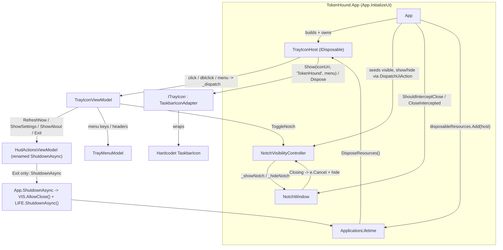

# TechSpec — System Tray NotifyIcon

## Sources and traceability

- PRD: [prd.md](file:///D:/MyProjects/TokenHound/tasks/prd-system-tray-notifyicon/prd.md), approved at HIL 1 (workflow.md D-003), sha256 `a4d491a7c796b52e1438e74eb6113198099bd3ec1b18fd0c36c11afe0c3203f7`.
- Applicable instructions and skills: [AGENTS.md](file:///D:/MyProjects/TokenHound/AGENTS.md) (Core purity, one sealed class per file, <= 300 lines / <= 30-line methods / <= 3 nesting, `nameof`, structured logging, `System.Text.Json`, `.ConfigureAwait(false)` in Core/Infrastructure only), [ARCHITECTURE.md](file:///D:/MyProjects/TokenHound/ARCHITECTURE.md) (WPF/.NET 10 layering, `Hardcodet.NotifyIcon.Wpf` sanctioned as the tray option, ~30-45 MB idle footprint), [CONTEXT.md](file:///D:/MyProjects/TokenHound/CONTEXT.md) (term "Notch"; avoid "window/overlay/widget/tray daemon"), skills `sdd-create-techspec` (+ `references/dotnet.md`), `dotnet-efficient-validation` (+ `references/mtp.md`), `repository-cli-efficiency`.
- Evidence in existing code:
  - [App.xaml.cs](file:///D:/MyProjects/TokenHound/src/TokenHound.App/App.xaml.cs) — `OnStartup` sets `ShutdownMode.OnExplicitShutdown`; `InitializeUi` builds `DialogService`, `NotchViewModel`, `ApplicationLifetime(usageStore, dialogService, notchViewModel, disposableResources)`, `HudActionsViewModel(usageStore.RefreshNowAsync, _lifetime.ShutdownAsync, showSettings, showAbout, snapshots)`, sets `MainWindow = _notchWindow`, `_notchWindow.Show()`; `DispatchUiAction(Action)` marshals to `Dispatcher`; `OnExit` calls `_lifetime?.Dispose()`.
  - [ApplicationLifetime.cs](file:///D:/MyProjects/TokenHound/src/TokenHound.App/ApplicationLifetime.cs) — `ShutdownAsync()` is idempotent (`_shutdownTask` latch under `_syncLock`); `ShutdownCoreAsync` cancels `_cts`, `DialogService.CloseAll()`, `NotchViewModel.Dispose()`, drains startup task + `UsageStore.StopAsync`, `DisposeResources()` over the injected `IReadOnlyList<IDisposable>`, then `_shutdownAction()` (default `Application.Shutdown()`).
  - [HudActionsViewModel.cs](file:///D:/MyProjects/TokenHound/src/TokenHound.App/ViewModels/HudActionsViewModel.cs) — ctor `(Func<CancellationToken,Task> refreshAction, Func<Task> closeAction, Action showSettings, Action showAbout, Func<IEnumerable<Snapshot>>? snapshotsProvider)`; `RefreshAsync` concurrency guard via `_isRefreshing`/`_isClosing` under `_syncLock`; `CloseAsync` idempotent (`_closeTask` latch), sets `_isClosing`, calls `_closeAction`; `ShowSettings`/`ShowAbout` no-op while `_isClosing`; `FormulateStatusText` static.
  - [NotchWindow.xaml](file:///D:/MyProjects/TokenHound/src/TokenHound.App/UI/Windows/NotchWindow.xaml) — `CapsuleContextMenu` items "Refresh", "Settings", "About", `<Separator/>`, "Close" (`x:Name="CloseMenuItem"`, `Click="OnCloseClick"`); `ShowInTaskbar="False"`, `Icon="../../Assets/logo.ico"`, `Title="TokenHound"`; `HudContextMenuStyle`/`HudMenuItemStyle` from [DialogResources.xaml](file:///D:/MyProjects/TokenHound/src/TokenHound.App/UI/Styles/DialogResources.xaml) (merged in `App.xaml`).
  - [NotchWindow.xaml.cs](file:///D:/MyProjects/TokenHound/src/TokenHound.App/UI/Windows/NotchWindow.xaml.cs) — `OnCloseClick` calls `_actionsViewModel?.CloseAsync()`; `OnSourceInitialized` calls `WindowStyles.EnableNonActivating(hwnd)` and adds the `WndProc` hook returning `MA_NOACTIVATE` (3) for `WM_MOUSEACTIVATE` (0x0021); `ApplyPlacement()` (private) restores persisted `HudPositionSettings` via `NotchPlacement`; no `Closing` handler today.
  - [DialogService.cs](file:///D:/MyProjects/TokenHound/src/TokenHound.App/UI/Windows/DialogService.cs) — modeless `ShowSettings`/`ShowAbout` activate-existing, dispatcher-guarded, `CloseAll()`.
  - [WindowStyles.cs](file:///D:/MyProjects/TokenHound/src/TokenHound.App/Interop/WindowStyles.cs) — `EnableNonActivating` sets `WS_EX_NOACTIVATE | WS_EX_TOOLWINDOW | WS_EX_TOPMOST`, `SetWindowPos` flags include `SWP_NOZORDER` (0x0004), omit `SWP_SHOWWINDOW`; idempotent (`newStyle != currentStyle` guard).
  - [UsageStore.cs](file:///D:/MyProjects/TokenHound/src/TokenHound.Infrastructure/Engine/UsageStore.cs) L200-L253 — the periodic timer lives in `_lifetime` (`StartTimer`/`StopTimer`), driven by `Start`/`UpdateCadence`; it has no reference to any window or to Notch visibility.
  - [TokenHound.App.csproj](file:///D:/MyProjects/TokenHound/src/TokenHound.App/TokenHound.App.csproj) — `net10.0-windows`, `UseWPF`, `OutputType=WinExe`, single `PackageReference` `Serilog` `Version="4.4.0"` (no central package management), `Assets\logo.ico` as `<Resource>` and `<ApplicationIcon>`.
  - [TokenHound.Infrastructure.Tests.csproj](file:///D:/MyProjects/TokenHound/tests/TokenHound.Infrastructure.Tests/TokenHound.Infrastructure.Tests.csproj) — `net10.0` (no `-windows`, no `UseWPF`), `OutputType=Exe`, `UseMicrosoftTestingPlatformRunner=true`, `xunit.v3.mtp-v2` `4.0.0`, `AwesomeAssertions` `9.6.0`, `NSubstitute` `6.2.0`; already links App view-model source with `<Compile Include="..\..\src\TokenHound.App\ViewModels\*.cs">` (17 entries incl. `HudActionsViewModel.cs`, `NotchViewModel.cs`, `CadenceSettingsViewModel.cs`) and `Interop\WindowStyles.cs`, `UI\Placement\NotchPlacement.cs`.
  - [HudActionsViewModelTests.cs](file:///D:/MyProjects/TokenHound/tests/TokenHound.Infrastructure.Tests/ViewModels/HudActionsViewModelTests.cs) — precedent: delegate injection, xUnit + AwesomeAssertions, MTP; tests `Constructor_WhenRequiredArgumentsNull...`, `RefreshAsync_WhenCanceledDuringClosing...`, `CloseAsync_GuardsRepeatedCalls_AndPreventsSubsequentActions` reference `CloseAsync`/`IsClosing`.
- Format reference (not edited): [prd-user-settings-persistence/techspec.md](file:///D:/MyProjects/TokenHound/tasks/prd-user-settings-persistence/techspec.md), [prd-settings-02-cadence-and-retries/techspec.md](file:///D:/MyProjects/TokenHound/tasks/prd-settings-02-cadence-and-retries/techspec.md).
- External: nuget.org (`dotnet package search` + registration API + nuspec) — `Hardcodet.NotifyIcon.Wpf` latest stable `2.0.1`, published 2024-10-16, MIT, zero transitive NuGet dependencies, assets for `.NETFramework4.6.2/4.7.2`, `net6.0-windows7.0`, `net8.0-windows7.0` (the `net8.0-windows7.0` asset is consumed by `net10.0-windows`); framework reference `Microsoft.WindowsDesktop.App` only.

## Solution summary

`TokenHound.App` gains a native notification-area icon owned for the whole process lifetime. All new code lives in `src/TokenHound.App/UI/Tray/` (namespace `TokenHound.App.UI.Tray`); `TokenHound.Core` and `TokenHound.Infrastructure` are untouched. The tray logic is split into a WPF-free seam — `NotchVisibilityController` (visibility state machine + close-interception flag), `TrayMenuModel` (item keys/order/headers), `TrayIconViewModel` (composes the existing `HudActionsViewModel` with the controller and the menu model; maps menu commands to actions), and `TrayIconHost` (coordinator: creation, graceful-degradation fallback, event wiring, dispatcher marshalling, disposal) — plus a thin `ITrayIcon` boundary whose only implementation, `TaskbarIconAdapter`, wraps `Hardcodet.NotifyIcon.Wpf`'s `TaskbarIcon` and builds the WPF `ContextMenu` (reusing `HudContextMenuStyle`). The seam has no dependency on a live `NotifyIcon` or a message loop, so it is unit-tested by delegate injection in `tests/TokenHound.Infrastructure.Tests` via `<Compile Include>` links, exactly as `HudActionsViewModel` is today.

The Notch context menu's "Close" item is relabelled "Hide" and rewired to hide the single long-lived `NotchWindow` instance instead of shutting down. A `Window.Closing` interceptor turns every OS-initiated or programmatic Notch close into a hide (`e.Cancel = true` + `Hide()`), preserving the HWND so the non-activating styles and the `WM_MOUSEACTIVATE` hook survive a later re-show. `HudActionsViewModel`'s terminal member is renamed from close to shutdown semantics (behaviour-preserving) and is invoked **only** by the tray "Exit" item, through a small `App` wrapper that flips the interceptor's bypass flag before delegating to the already-idempotent `ApplicationLifetime.ShutdownAsync`. `TrayIconHost` is registered in the existing `disposableResources` list, so the icon is always removed on the coordinated shutdown; on abnormal termination the OS reclaims it. If the icon cannot be registered, `TrayIconHost` logs a structured warning and the Notch stays as the primary surface.

## Technical decisions

| ID | PRD obligations | Decision | Reason and evidence | Alternatives and trade-offs |
| --- | --- | --- | --- | --- |
| DEC-01 | FR-01, FR-02, NFR-03, NFR-04, NFR-05, NFR-10, OBJ-01 | Adopt **`Hardcodet.NotifyIcon.Wpf` version `2.0.1`** as a version-pinned `<PackageReference>` in `TokenHound.App.csproj` (inline `Version`, mirroring `Serilog 4.4.0`; no central package management). The `TaskbarIcon` never leaves `TaskbarIconAdapter`. | `ARCHITECTURE.md` sanctions this exact library; NFR-03 forbids any other. Confirmed latest stable on nuget.org: `2.0.1` (2024-10-16), MIT, **zero transitive NuGet dependencies** (only `frameworkReference Microsoft.WindowsDesktop.App`, already present), `net8.0-windows7.0` asset consumed by `net10.0-windows` with no TFM/`OutputType`/`UseWPF` change (NFR-04). Gives a WPF `ContextMenu` (reuses `HudContextMenuStyle`, OS-standard keyboard/screen-reader menu — NFR-10), `TrayLeftMouseUp`/`TrayMouseDoubleClick` events, `IconSource` from a pack URI, `WM_TASKBARCREATED` re-registration after Explorer restart (OBJ-01), and `IDisposable` that issues `NIM_DELETE` (NFR-07). Event-driven, no polling (NFR-05). | Rejected: a zero-dependency Win32 `Shell_NotifyIcon` P/Invoke wrapper. It would re-implement a message-only window, `WM_TASKBARCREATED` re-add, `NIM_ADD/MODIFY/DELETE`, HICON lifetime, HiDPI frame selection, and menu rendering (`TrackPopupMenuEx` + `WM_COMMAND`, an unstyled native menu, or manual WPF-menu hosting) by hand — 2-3 files near the 300-line limit with untested interop, losing the existing dark menu styling for **no** dependency-surface gain beyond one MIT package with no transitive deps. |
| DEC-02 | FR-06, FR-07, FR-08, FR-09, OBJ-04, OBJ-05, OBJ-06, NFR-01, NFR-07, NFR-11, A-03 | **Keep `HudActionsViewModel` behaviourally intact; rename only its terminal member to shutdown semantics; add a separate `NotchVisibilityController` for hide/show; compose both in a new `TrayIconViewModel`.** `HudActionsViewModel`: `closeAction`->`shutdownAction`, `CloseAsync`->`ShutdownAsync`, `_closeTask`->`_shutdownTask`, `_isClosing`->`_isShuttingDown`, `IsClosing`->`IsShuttingDown` (identical idempotent-latch behaviour; method count/size unchanged). Wired **only** to tray "Exit". | The `_isClosing` latch permanently disables Refresh/Settings/About (`ShowSettings`/`ShowAbout` no-op, `RefreshAsync` early-return) — correct for shutdown, **wrong for hide**: after hiding the Notch the tray must still Refresh/Settings/About (FR-06/07, US-04/05/06). So hide needs its own non-latching action. `TrayIconViewModel` reuses `HudActionsViewModel.RefreshAsync` (its guard satisfies FR-06) and `ShowSettings`/`ShowAbout` (FR-07) with no duplicated command bodies (OBJ-05). Rename keeps names honest (NFR-02 `nameof`, self-describing) now that "Close" leaves the Notch menu and the delegate means only Exit. | Rejected (A-03 option a, pure repurpose): redirect the second delegate to "hide" — breaks the tray menu via the latch, and would force stripping/duplicating latch logic in a shared 248-line class plus its whole test file. Acceptable smaller-diff alternative: leave `CloseAsync`/`IsClosing` names and only re-point the delegate; the plan may choose this if it prefers minimal churn, at the cost of a misleading name. |
| DEC-03 | FR-05, FR-09, FR-10, FR-11, OBJ-02, OBJ-03, NFR-06, A-01, A-04 | **Intercept Notch close in `NotchWindow.Closing`**: if `ShouldInterceptClose?.Invoke() == true` then `e.Cancel = true` and invoke the injected hide delegate; never recreate the window. `OnCloseClick` (the renamed "Hide" item) calls the same hide delegate directly. **"Exit" bypasses** by calling `NotchVisibilityController.AllowClose()` (sets a one-way flag making `ShouldInterceptClose` return `false`) before `ApplicationLifetime.ShutdownAsync`; `Application.Shutdown()` then closes the Notch uncancelled. Add `NotchWindow.ShowNotch()` = `Show()` + `ApplyPlacement()` (no `Activate()`); `HideNotch()` = `Hide()`. | `Window.Hide()` keeps the HWND, so the `HwndSource` `WndProc` hook and `WS_EX_NOACTIVATE|WS_EX_TOOLWINDOW|WS_EX_TOPMOST` set once in `OnSourceInitialized` survive hide/show (NFR-06); re-show through `ApplyPlacement` reuses the existing non-activating placement path (FR-05) and never activates. `UsageStore`'s timer is in `_lifetime`, unrelated to the window, so hiding cannot pause polling (FR-11). One long-lived instance preserved (A-01). With `ShutdownMode.OnExplicitShutdown` + `MainWindow = _notchWindow` the process already outlives a hidden Notch (A-04); only the way back and the Exit bypass are new. | Rejected: `ShowInTaskbar` toggling / minimise-to-tray — does not remove the on-screen Notch. Rejected: destroy + recreate `NotchWindow` per toggle — loses the HWND, the hook, placement state, and `NotchViewModel` wiring; contradicts A-01. Rejected: intercept in `App.SessionEnding` only — misses programmatic/`Alt+F4` closes. |
| DEC-04 | NFR-01, NFR-02, NFR-08, NFR-09, FR-01 | **New code under `src/TokenHound.App/UI/Tray/`, namespace `TokenHound.App.UI.Tray`, one sealed class per file.** Wire-up in `App.InitializeUi` after `_notchWindow.Show()`: build `NotchVisibilityController` (show/hide delegates = `DispatchUiAction(() => _notchWindow.ShowNotch()/HideNotch())`, seeded visible), `TrayIconViewModel(_actionsViewModel, controller, new TrayMenuModel())`, `TrayIconHost(new TaskbarIconAdapter(), trayIconViewModel, DispatchUiAction, iconUri, Log.Logger)`; `disposableResources.Add(trayIconHost)`. Set `_notchWindow.ShouldInterceptClose`/`CloseIntercepted`. | Matches the `UI/Windows`, `UI/Placement`, `Interop` folder convention (`ARCHITECTURE.md` §3). `disposableResources` is already disposed by `ApplicationLifetime.DisposeResources()` on the coordinated path — reusing it guarantees icon removal (NFR-07) with no `ApplicationLifetime` change. `TrayIconHost` receives `App.DispatchUiAction` and wraps every tray callback (NFR-08); it receives `Serilog.ILogger` and emits one structured entry per action / lifecycle event with `nameof` state tokens (NFR-09). | Rejected: a dedicated tray bootstrap `Program.cs` (the `ARCHITECTURE.md` tree mentions one that does not exist) — larger change, no benefit; recorded as a doc-reconciliation impact instead. Rejected: owning the icon in `NotchWindow` — couples window lifetime to process lifetime, the bug this PRD fixes. |
| DEC-05 | NFR-11, A-07 | **Add the WPF-free seam classes to `tests/TokenHound.Infrastructure.Tests` via `<Compile Include>` links; do NOT create `TokenHound.App.Tests` for v1.** New links for `NotchVisibilityController.cs`, `TrayMenuModel.cs`, `TrayMenuItemKey.cs`, `TrayIconViewModel.cs`, `TrayIconHost.cs`; new tests under `tests/TokenHound.Infrastructure.Tests/Tray/`. | Every existing App view-model test (`HudActionsViewModel`, `NotchViewModel`, `CadenceSettingsViewModel`) already uses this pattern; the sibling `prd-settings-02` TechSpec chose it too. No new `.csproj`, no `TokenHound.slnx` edit. The four seam classes staying compilable under `net10.0` (no `UseWPF`) is itself proof of NFR-01 (no WPF/OS coupling). | Rejected for v1: a new `net10.0-windows` `UseWPF` `TokenHound.App.Tests` with a `ProjectReference` — the better long-term home (the `<Compile Include>` list is at 17 and growing) but a separate slice: new `.csproj`, `TokenHound.slnx` write, STA/dispatcher plumbing. Recorded as an open item. |
| DEC-06 | FR-01, FR-12, NFR-01, NFR-11 | **`TrayIconHost` is WPF-free and linkable**; it depends only on `ITrayIcon`, `TrayIconViewModel`, `Action<Action>` dispatcher, `ILogger`, and a menu-descriptor from `TrayMenuModel`. The WPF `ContextMenu` construction and the pack-URI icon load live inside `TaskbarIconAdapter` (the only file referencing the package or `System.Windows.Controls`). | Makes FR-01 (single-create / double-dispose guard), FR-12 (init-failure fallback), NFR-07 (dispose removes icon), NFR-08 (dispatcher marshalling) all unit-testable with a `FakeTrayIcon`. `TaskbarIconAdapter` is a straight-line adapter whose visuals are covered by the manual script (steps 2, 9). | Rejected: a WPF-coupled `TrayIconHost` — would need `TokenHound.App.Tests` (DEC-05) just to test the fallback path. |
| DEC-07 | FR-12 | **Graceful degradation**: `TrayIconHost.Initialize()` wraps `ITrayIcon.Show(...)` in `try/catch`; on failure it logs `Log.Warning` with the exception and `nameof` context, sets `IsDegraded = true`, and does nothing else — the Notch (already shown by `InitializeUi`) remains the primary surface. Startup never throws from the tray path. | FR-12: "app still shows the Notch and logs the warning". `InitializeUi` shows the Notch before the tray is built, so the fallback is simply "do not rethrow". | Rejected: retry loop / balloon error — out of scope, adds a timer (NFR-05). |
| DEC-08 | FR-01, NFR-08, NFR-09, NFR-10, A-02 | **Icon + copy from existing resource and constants.** `TaskbarIconAdapter` loads `Assets/logo.ico` via `IconSource = new Uri("pack://application:,,,/Assets/logo.ico")` (already `<Resource>`; the multi-frame `.ico` carries 16/32 px per A-02 — NFR-10). `TrayMenuModel` holds `UPPER_CASE` constants: `TOOLTIP = "TokenHound"`, `HIDE_NOTCH_HEADER = "Hide Notch"`, `SHOW_NOTCH_HEADER = "Show Notch"`, `REFRESH_HEADER = "Refresh Now"`, `SETTINGS_HEADER = "Settings\u2026"`, `ABOUT_HEADER = "About\u2026"`, `EXIT_HEADER = "Exit"`. All tray callbacks run through `DispatchUiAction` (NFR-08); every action logs once (NFR-09). | Reuses the shipped icon (constraint: `logo.ico` already declared). Constants + `nameof` satisfy NFR-02/NFR-09. `\u2026` is the ellipsis character used by the PRD UX copy. | Rejected: `System.Drawing.Icon` from a resource stream — pulls `System.Drawing.Common` semantics into our code; `IconSource` keeps the conversion inside the library. The plan may switch to the `Icon` property if frame-selection proves soft at 200% (A-02 fallback: regenerate `logo.ico`). |

## Components and flow

| ID | Component | New or modified | Responsibility | Dependencies |
| --- | --- | --- | --- | --- |
| CMP-01 | `src/TokenHound.App/UI/Tray/ITrayIcon.cs` | New | Seam interface: `void Show(Uri iconSource, string tooltip, TrayMenuDescriptor menu)`, `void UpdateToggleHeader(string header)`, events `EventHandler LeftClicked` / `DoubleClicked` / `EventHandler<TrayMenuItemKey> MenuItemInvoked` / `EventHandler MenuOpening`, `IDisposable`. No WPF types in the signature (`Uri`, `string`, POCO descriptor only). | — |
| CMP-02 | `src/TokenHound.App/UI/Tray/TaskbarIconAdapter.cs` | New | Sole implementation of `ITrayIcon`; owns a `Hardcodet.Wpf.TaskbarNotification.TaskbarIcon`; builds a `ContextMenu` (`HudContextMenuStyle`/`HudMenuItemStyle`) from `TrayMenuDescriptor`; maps `TrayLeftMouseUp`/`TrayMouseDoubleClick`/`ContextMenuOpening`/`MenuItem.Click` to the interface events; `Dispose()` disposes the `TaskbarIcon` (issues `NIM_DELETE`), idempotent. Only file referencing the package. | CMP-01, DEC-01, DEC-08 |
| CMP-03 | `src/TokenHound.App/UI/Tray/NotchVisibilityController.cs` | New | WPF-free state machine. `bool IsNotchVisible` (single source of truth, seeded `true`); `Show()`/`Hide()`/`Toggle()` invoke exactly one injected `Action` (`_showNotch`/`_hideNotch`) per transition and raise `event EventHandler VisibilityChanged`; close bypass: `bool ShouldInterceptClose => !_shutdownRequested`, `void AllowClose()` (one-way). Nesting <= 1. | — |
| CMP-04 | `src/TokenHound.App/UI/Tray/TrayMenuItemKey.cs` | New | `enum TrayMenuItemKey { ToggleNotch, RefreshNow, Settings, About, Exit }`. | — |
| CMP-05 | `src/TokenHound.App/UI/Tray/TrayMenuModel.cs` | New | WPF-free. `UPPER_CASE` copy constants (DEC-08); `IReadOnlyList<TrayMenuEntry> BuildDescriptor(bool notchVisible)` returning keys + headers + a separator marker before `Exit` in fixed order; `static string ResolveToggleHeader(bool notchVisible)`. `TrayMenuDescriptor`/`TrayMenuEntry` are `record` DTOs in this file (nested types allowed). | CMP-04 |
| CMP-06 | `src/TokenHound.App/UI/Tray/TrayIconViewModel.cs` | New | WPF-free, `INotifyPropertyChanged`. Composes `HudActionsViewModel` + `NotchVisibilityController` + `TrayMenuModel`. `ToggleNotch()` -> `controller.Toggle()`; `RefreshNow()` -> `hud.RefreshAsync()`; `ShowSettings()`/`ShowAbout()` -> `hud.ShowSettings()`/`ShowAbout()`; `Exit()` -> `hud.ShutdownAsync()`. `string ToggleHeader` (raises `PropertyChanged` on `VisibilityChanged`); `TrayMenuDescriptor CurrentMenu` (rebuilt on menu-opening). Maps `TrayMenuItemKey` -> action in one `switch`. | CMP-03, CMP-05, CMP-11 |
| CMP-07 | `src/TokenHound.App/UI/Tray/TrayIconHost.cs` | New, `IDisposable` | WPF-free coordinator. `Initialize()`: guard against second call; `try { _trayIcon.Show(iconUri, TrayMenuModel.TOOLTIP, vm.CurrentMenu); } catch (Exception ex) { log warning; IsDegraded = true; return; }` (DEC-07); subscribe interface events -> `_dispatch(() => vm.X())` (NFR-08); on `MenuOpening` rebuild descriptor + `UpdateToggleHeader`; log every action + `created`/`removed`/`creation failed` (NFR-09). `Dispose()`: idempotent, `_trayIcon.Dispose()`. | CMP-01, CMP-06, DEC-04, DEC-06, DEC-07 |
| CMP-08 | `src/TokenHound.App/ViewModels/HudActionsViewModel.cs` | Modified | Behaviour-preserving rename (DEC-02): `closeAction`->`shutdownAction`, `CloseAsync`->`ShutdownAsync`, `_closeTask`->`_shutdownTask`, `_isClosing`->`_isShuttingDown`, `IsClosing`->`IsShuttingDown`, XML docs. No logic change. | — |
| CMP-09 | `src/TokenHound.App/UI/Windows/NotchWindow.xaml` + `.xaml.cs` | Modified | XAML: `CloseMenuItem` `Header="Close"`->`Header="Hide"` (keep `x:Name`, `Click`). Code-behind: `OnCloseClick` -> invoke `CloseIntercepted` (hide) instead of `_actionsViewModel.CloseAsync()`; add `Closing += OnClosing` -> `if (ShouldInterceptClose?.Invoke() == true) { e.Cancel = true; CloseIntercepted?.Invoke(); }`; add `public Func<bool>? ShouldInterceptClose`, `public Action? CloseIntercepted`, `public void ShowNotch()` (`Show()` + `ApplyPlacement()`, no `Activate()`), `public void HideNotch()` (`Hide()`). Stays <= 300 lines. | CMP-03 via delegates |
| CMP-10 | `src/TokenHound.App/App.xaml.cs` | Modified | `InitializeUi`: after `_notchWindow.Show()` build `NotchVisibilityController`, `TrayIconViewModel`, `TrayIconHost`; `disposableResources.Add(host)`; `host.Initialize()`; set `_notchWindow.ShouldInterceptClose = () => _visibility.ShouldInterceptClose`, `_notchWindow.CloseIntercepted = _visibility.Hide`. Change `HudActionsViewModel` 2nd arg from `_lifetime.ShutdownAsync` to a new `private Task ShutdownAsync()` => `{ _visibility!.AllowClose(); return _lifetime!.ShutdownAsync(); }`. Add field `NotchVisibilityController? _visibility`, `TrayIconHost? _trayHost`. | CMP-03, CMP-06, CMP-07 |
| CMP-11 | `src/TokenHound.App/TokenHound.App.csproj` | Modified | Add `<PackageReference Include="Hardcodet.NotifyIcon.Wpf" Version="2.0.1" />` to the `Serilog` `ItemGroup`. No other change. | DEC-01 |
| CMP-12 | `tests/TokenHound.Infrastructure.Tests/TokenHound.Infrastructure.Tests.csproj` | Modified | Add `<Compile Include>` links for CMP-03, CMP-04, CMP-05, CMP-06, CMP-07 (`Link="Tray\..."`). | DEC-05 |
| CMP-13 | `tests/TokenHound.Infrastructure.Tests/Tray/*Tests.cs` (+ `Engine/NotchHiddenPollingTests.cs`) | New | `NotchVisibilityControllerTests`, `TrayMenuModelTests`, `TrayIconViewModelTests`, `TrayIconHostTests`, plus one integration test that polling continues while hidden. | CMP-03..CMP-07 |
| CMP-14 | `tests/TokenHound.Infrastructure.Tests/ViewModels/HudActionsViewModelTests.cs` | Modified | Rename references `CloseAsync`->`ShutdownAsync`, `IsClosing`->`IsShuttingDown` in the 3 affected tests; keep assertions. | CMP-08 |

### Flow



Startup: `InitializeUi` shows the Notch (unchanged), then builds the tray graph and calls `host.Initialize()`, which registers one icon with tooltip "TokenHound" and the context menu, or logs a warning and continues degraded (FR-12). Toggle: a left-click / double-click / "Hide Notch"/"Show Notch" item reaches `TrayIconViewModel.ToggleNotch()` -> `NotchVisibilityController.Toggle()` -> exactly one `_showNotch`/`_hideNotch` delegate -> `DispatchUiAction(() => _notchWindow.ShowNotch()/HideNotch())`; `VisibilityChanged` updates `ToggleHeader`, re-pushed to the icon on the next `MenuOpening`. Notch close: the "Hide" item or any `Window.Closing` is cancelled and routed to `Hide()`; the process keeps running and polling (FR-10/FR-11). Exit: "Exit" -> `HudActionsViewModel.ShutdownAsync()` (idempotent latch, disables further tray actions) -> `App.ShutdownAsync()` sets `AllowClose()` then awaits `ApplicationLifetime.ShutdownAsync()`, which drains the engine, `DisposeResources()` disposes `TrayIconHost` (icon removed), and `Application.Shutdown()` closes the now-uncancelled Notch.

## Contracts and data

No persisted data, no wire contracts, no configuration keys (PRD: "Persistence: none required for v1"). New in-process seam:

```csharp
namespace TokenHound.App.UI.Tray;

/// <summary>Boundary over the OS notification-area icon; no live NotifyIcon leaks past this type.</summary>
public interface ITrayIcon : IDisposable
{
    void Show(Uri iconSource, string tooltip, TrayMenuDescriptor menu);
    void UpdateToggleHeader(string header);
    event EventHandler LeftClicked;
    event EventHandler DoubleClicked;
    event EventHandler MenuOpening;
    event EventHandler<TrayMenuItemKey> MenuItemInvoked;
}

public enum TrayMenuItemKey { ToggleNotch, RefreshNow, Settings, About, Exit }

public sealed record TrayMenuEntry
{
    public required TrayMenuItemKey Key { get; init; }
    public required string Header { get; init; }
    public bool PrecededBySeparator { get; init; }
}

public sealed record TrayMenuDescriptor
{
    public required IReadOnlyList<TrayMenuEntry> Entries { get; init; } // ToggleNotch, RefreshNow, Settings, About, [sep] Exit
}

public sealed class NotchVisibilityController
{
    public NotchVisibilityController(Action showNotch, Action hideNotch, bool initiallyVisible = true);
    public bool IsNotchVisible { get; }
    public bool ShouldInterceptClose { get; }   // !_shutdownRequested
    public event EventHandler? VisibilityChanged;
    public void Show();                          // no-op if already visible; else one showNotch() + event
    public void Hide();                          // no-op if already hidden; else one hideNotch() + event
    public void Toggle();                        // exactly one transition
    public void AllowClose();                    // one-way; ShouldInterceptClose -> false
}

public sealed class TrayIconViewModel : INotifyPropertyChanged
{
    public TrayIconViewModel(HudActionsViewModel hudActions, NotchVisibilityController visibility, TrayMenuModel menu);
    public string ToggleHeader { get; }         // TrayMenuModel.ResolveToggleHeader(visibility.IsNotchVisible)
    public TrayMenuDescriptor BuildMenu();       // menu.BuildDescriptor(visibility.IsNotchVisible)
    public void Invoke(TrayMenuItemKey key);     // switch -> ToggleNotch/RefreshNow/ShowSettings/ShowAbout/Exit
    public void ToggleNotch();
    public Task RefreshNow();                    // hudActions.RefreshAsync()
    public void ShowSettings();                  // hudActions.ShowSettings()
    public void ShowAbout();                     // hudActions.ShowAbout()
    public Task Exit();                          // hudActions.ShutdownAsync()
}

public sealed class TrayIconHost : IDisposable
{
    public TrayIconHost(ITrayIcon trayIcon, TrayIconViewModel viewModel, Action<Action> dispatch, Uri iconSource, ILogger logger);
    public bool IsDegraded { get; }
    public void Initialize();                    // idempotent; try/catch -> warning + IsDegraded (FR-12)
    public void Dispose();                       // idempotent; trayIcon.Dispose()
}
```

`HudActionsViewModel` change (compatibility): rename only. Callers to update: `App.xaml.cs` (constructor arg + delegate), `NotchWindow.xaml.cs` (`OnCloseClick` no longer calls it), `HudActionsViewModelTests.cs`. No serialized form; no external consumer.

`NotchWindow` additions: `Func<bool>? ShouldInterceptClose`, `Action? CloseIntercepted`, `void ShowNotch()`, `void HideNotch()` — all set/called only from `App.xaml.cs`.

## Integrations and interfaces

- **Notification-area icon (new UI surface)**: one icon, `Assets/logo.ico` via `pack://application:,,,/Assets/logo.ico`, tooltip "TokenHound"; left-click and double-click toggle Notch visibility; right-click context menu `Hide Notch` / `Show Notch` -> `Refresh Now` -> `Settings\u2026` -> `About\u2026` -> separator -> `Exit`, styled with `HudContextMenuStyle`/`HudMenuItemStyle`. Errors: creation failure is swallowed with `Log.Warning` (FR-12); no timeout/idempotency concerns (event-driven).
- **Notch context menu (label change only)**: `CloseMenuItem` header `Close` -> `Hide`; no other item changes (PRD out-of-scope: no ellipsis edits to Settings/About there).
- **`DialogService`**: reused unchanged — `HudActionsViewModel.ShowSettings`/`ShowAbout` already route through it with activate-existing and dispatcher guards (FR-07).
- **`ApplicationLifetime`**: reused unchanged — `ShutdownAsync` already idempotent; the tray adds one caller (`App.ShutdownAsync` wrapper) and one disposable (`TrayIconHost`) in the existing list.
- **`TokenHound.App.csproj`**: `+ <PackageReference Include="Hardcodet.NotifyIcon.Wpf" Version="2.0.1" />`. No `TargetFramework`/`OutputType`/`UseWPF`/`ApplicationIcon` change (NFR-04).
- **`TokenHound.slnx`**: no change (DEC-05).
- **`tests/TokenHound.Infrastructure.Tests.csproj`**: `+` five `<Compile Include>` links under `Link="Tray\..."`.

## Errors, security, and recovery

- **Errors and edges**: tray registration failure -> structured `Log.Warning`, `IsDegraded = true`, Notch stays primary, startup continues (FR-12, DEC-07). Second `TrayIconHost.Initialize()` -> no-op (FR-01). `NotchVisibilityController.Show()`/`Hide()` when already in that state -> no-op, no delegate, no event (guards US-07 double-toggle / A-05 debounce: one gesture -> at most one transition). Tray click after "Exit" -> `HudActionsViewModel` latch (`_isShuttingDown`) makes `RefreshNow`/`ShowSettings`/`ShowAbout` no-ops; `Exit` returns the cached task (FR-07, FR-08). `Window.Closing` during shutdown after `AllowClose()` -> not cancelled.
- **Authorization and sensitive data**: none. No credentials, no files, no network. `TokenHound.Core`/`TokenHound.Infrastructure` untouched (NFR-01). No SQLite / 429 / credential invariants apply.
- **Concurrency and idempotency**: all tray callbacks marshalled to the WPF dispatcher via `App.DispatchUiAction` before touching `NotchWindow`/`DialogService` (NFR-08); `NotchVisibilityController` mutated only on the UI thread. Exactly one `ApplicationLifetime.ShutdownAsync` execution per process (existing `_shutdownTask` latch + `HudActionsViewModel._shutdownTask` latch) (NFR-07). Icon removed exactly once (`TrayIconHost.Dispose` idempotent + `TaskbarIcon.Dispose` idempotent); on crash the OS reclaims it.
- **Rollback or reversal**: revert CMP-08..CMP-14 and remove the `PackageReference`. No migration, no persisted state, no data compatibility surface. Reverting restores the previous "Close = shutdown" behaviour.

## Sequencing

| Step | Depends on | Verifiable result |
| --- | --- | --- |
| 1. Seam DTOs + state machine | — | `ITrayIcon`, `TrayMenuItemKey`, `TrayMenuEntry`/`TrayMenuDescriptor`, `TrayMenuModel`, `NotchVisibilityController` compile in `TokenHound.App` and (via new links) in `TokenHound.Infrastructure.Tests`; `NotchVisibilityControllerTests` + `TrayMenuModelTests` green. |
| 2. `HudActionsViewModel` rename | — | Rename applied; `HudActionsViewModelTests` updated and green; solution builds. |
| 3. `TrayIconViewModel` | 1, 2 | Command->action mapping + `ToggleHeader` implemented; `TrayIconViewModelTests` green (reuses `HudActionsViewModel` refresh guard, no duplicated bodies). |
| 4. `TrayIconHost` + `TaskbarIconAdapter` | 1, 3, CMP-11 | `TrayIconHost` (WPF-free) with `FakeTrayIcon` -> `TrayIconHostTests` green (single-create, dispatcher spy, dispose, FR-12 fallback). `TaskbarIconAdapter` builds and renders (manual). |
| 5. `NotchWindow` hide + close intercept | 1 | "Hide" label; `OnClosing` cancels + hides; `ShowNotch`/`HideNotch`; `NotchWindow` <= 300 lines. |
| 6. `App.InitializeUi` wiring + `App.ShutdownAsync` | 2, 3, 4, 5 | App launches: one tray icon, tooltip, menu; hide/show; "Exit" removes the icon and logs "Application shutdown completed successfully." Manual script (MAN-01) passes. |
| 7. Integration + docs reconciliation | 6 | `NotchHiddenPollingTests` green; `ARCHITECTURE.md` tree note and `docs/ROADMAP.md` PRD 11 status updated by the coordinator (out of this write scope — recorded as impacts). `graft build` rerun. |

## Test approach

- Profile: three projects — `src/TokenHound.App` (`net10.0-windows`, WPF, `WinExe`), `src/TokenHound.Infrastructure` (`net10.0`), `src/TokenHound.Core` (`net10.0`); `TokenHound.Infrastructure` / `TokenHound.Core` untouched. Runner: Microsoft.Testing.Platform (native, `global.json` `test.runner = Microsoft.Testing.Platform`, SDK `10.0.400`) with `xunit.v3.mtp-v2 4.0.0` + `AwesomeAssertions 9.6.0` + `NSubstitute 6.2.0` in `tests/TokenHound.Infrastructure.Tests`. Presentation-logic strategy: link the WPF-free seam classes into `tests/TokenHound.Infrastructure.Tests` via `<Compile Include>` and test by delegate injection with a hand-written `FakeTrayIcon` (records `Show`/`Dispose`, can throw on demand) and an `Action<Action>` dispatcher spy — no live `NotifyIcon`, no message loop (NFR-11).
- E2E: **omitted by desktop .NET policy.** No browser/WebView/desktop-UI-automation scenario exists for this feature. There is no aggregate suite that pulls E2E; the whole-project runs below are unit + integration only. Acceptance is preserved by the unit tests (toggle state machine, menu model, command->action mapping, close-interception flag, graceful-degradation path), one integration test (polling continues while hidden), and the PRD's 11-step manual script.
- Command prerequisites and exclusions: build the affected projects first; run project-scoped, keep `--minimum-expected-tests 1`, preserve `$LASTEXITCODE`, never `Out-Null`. No desktop-E2E filter needed (none present).

```powershell
rtk dotnet build src/TokenHound.App/TokenHound.App.csproj -c Release --nologo -v minimal
if ($LASTEXITCODE -ne 0) { exit $LASTEXITCODE }
rtk dotnet build tests/TokenHound.Infrastructure.Tests/TokenHound.Infrastructure.Tests.csproj -c Release --nologo -v minimal
if ($LASTEXITCODE -ne 0) { exit $LASTEXITCODE }

# Focused classes (xUnit v3 on MTP -> --filter-class after --)
rtk dotnet test --project tests/TokenHound.Infrastructure.Tests/TokenHound.Infrastructure.Tests.csproj --no-build --no-restore -- --minimum-expected-tests 1 --filter-class "*NotchVisibilityControllerTests*"
if ($LASTEXITCODE -ne 0) { exit $LASTEXITCODE }
rtk dotnet test --project tests/TokenHound.Infrastructure.Tests/TokenHound.Infrastructure.Tests.csproj --no-build --no-restore -- --minimum-expected-tests 1 --filter-class "*TrayMenuModelTests*"
if ($LASTEXITCODE -ne 0) { exit $LASTEXITCODE }
rtk dotnet test --project tests/TokenHound.Infrastructure.Tests/TokenHound.Infrastructure.Tests.csproj --no-build --no-restore -- --minimum-expected-tests 1 --filter-class "*TrayIconViewModelTests*"
if ($LASTEXITCODE -ne 0) { exit $LASTEXITCODE }
rtk dotnet test --project tests/TokenHound.Infrastructure.Tests/TokenHound.Infrastructure.Tests.csproj --no-build --no-restore -- --minimum-expected-tests 1 --filter-class "*TrayIconHostTests*"
if ($LASTEXITCODE -ne 0) { exit $LASTEXITCODE }
rtk dotnet test --project tests/TokenHound.Infrastructure.Tests/TokenHound.Infrastructure.Tests.csproj --no-build --no-restore -- --minimum-expected-tests 1 --filter-class "*HudActionsViewModelTests*"
if ($LASTEXITCODE -ne 0) { exit $LASTEXITCODE }
rtk dotnet test --project tests/TokenHound.Infrastructure.Tests/TokenHound.Infrastructure.Tests.csproj --no-build --no-restore -- --minimum-expected-tests 1 --filter-class "*NotchHiddenPollingTests*"
if ($LASTEXITCODE -ne 0) { exit $LASTEXITCODE }

# Aggregate (still unit + integration only; no E2E anywhere)
rtk dotnet test --project tests/TokenHound.Infrastructure.Tests/TokenHound.Infrastructure.Tests.csproj --no-build --no-restore -- --minimum-expected-tests 1
if ($LASTEXITCODE -ne 0) { exit $LASTEXITCODE }
```

Equivalent MTP-executable route if `dotnet test` project selection is unavailable (`references/mtp.md`): `rtk dotnet run --project tests/TokenHound.Infrastructure.Tests/TokenHound.Infrastructure.Tests.csproj --no-build --no-restore -- --minimum-expected-tests 1 --filter-class "*<Name>*"`. If RTK hides a failure detail, rerun that one command with `rtk proxy dotnet ...`.

Manual acceptance: the PRD "Manual acceptance script (Windows 11 interactive desktop)" steps 1-11 (`MAN-01`). Owner: coordinator at HIL 3. Launch via Windows MCP `App` tool (`mode="launch_executable"`); verify with `Screenshot` on `display: [2]`. Expected result per PRD step text; until executed, essential acceptance for FR-01/FR-03/FR-05/FR-08/FR-09/NFR-06/NFR-10 remains pending.

| ID | Obligations | Level | Scenario | Expected result | Command or project |
| --- | --- | --- | --- | --- | --- |
| TC-01 | FR-01, US-08, NFR-07 | Unit | `TrayIconHost.Initialize()` with `FakeTrayIcon`; then call `Initialize()` again; then `Dispose()` twice. | `Show` called once with the `logo.ico` URI and tooltip `"TokenHound"`; second `Initialize` is a no-op; `Dispose` disposes the icon once; second `Dispose` safe. | `TrayIconHostTests` |
| TC-02 | FR-02, NFR-10 | Unit | `TrayMenuModel.BuildDescriptor(true)`. | Entries are exactly `ToggleNotch, RefreshNow, Settings, About, Exit` in that order; `Exit.PrecededBySeparator == true`, others `false`; headers match the copy constants. | `TrayMenuModelTests` |
| TC-03 | FR-03, US-01, US-07, A-05 | Unit | `NotchVisibilityController` seeded visible: `Toggle()` twice; `Hide()` then `Hide()`. | First `Toggle` -> `IsNotchVisible=false` + one `_hideNotch` + one event; second -> visible + one `_showNotch`; redundant `Hide()` -> no delegate, no event. | `NotchVisibilityControllerTests` |
| TC-04 | FR-04, OBJ-06 | Unit | `ResolveToggleHeader(true)` / `(false)`; subscribe to `TrayIconViewModel.PropertyChanged`, toggle. | `"Hide Notch"` / `"Show Notch"`; `PropertyChanged(nameof(ToggleHeader))` raised on each transition; `BuildMenu()` reflects the new header. | `TrayMenuModelTests`, `TrayIconViewModelTests` |
| TC-05 | FR-05, NFR-06 | Unit | `NotchVisibilityController.Show()` from hidden with spy delegates. | The injected `_showNotch` (bound in `App` to `ShowNotch` = placement path, no `Activate`) is invoked exactly once; no activate/focus delegate exists on the controller. | `NotchVisibilityControllerTests` |
| TC-06 | FR-06, US-04, OBJ-05 | Unit | `TrayIconViewModel.RefreshNow()` twice while the injected refresh `TaskCompletionSource` is pending. | Underlying refresh delegate invoked once (reuses `HudActionsViewModel` `_isRefreshing` guard); no second dispatch. | `TrayIconViewModelTests` |
| TC-07 | FR-07, US-05, US-06, OBJ-05 | Unit | `ShowSettings()` / `ShowAbout()` before and after `Exit()`. | Before: each calls the matching `HudActionsViewModel` delegate once. After `Exit()` latched: both are no-ops. | `TrayIconViewModelTests` |
| TC-08 | FR-08, OBJ-04, NFR-07 | Unit | `Invoke(Exit)` twice; also invoke every other key. | Shutdown delegate runs once (cached task); no other key path reaches the shutdown delegate. | `TrayIconViewModelTests`, `HudActionsViewModelTests` |
| TC-09 | FR-09, OBJ-06 | Unit | Simulate the Notch "Hide" path: `CloseIntercepted` delegate = `controller.Hide`. | Invoking it flips visibility via `_hideNotch`; the shutdown delegate is never touched. | `NotchVisibilityControllerTests` |
| TC-10 | FR-10, OBJ-03 | Unit | `ShouldInterceptClose` before `AllowClose()`, after `AllowClose()`, and the intercept branch (`ShouldInterceptClose==true` -> `Hide()` invoked). | `true` -> `false` (one-way); intercept invokes `_hideNotch` once; no shutdown. | `NotchVisibilityControllerTests` |
| TC-11 | FR-11, US-02 | Integration | Drive a `UsageStore` with a fake provider at a short interval; call `NotchVisibilityController.Hide()`; wait. | >= 2 poll ticks recorded after hide; `NotchVisibilityController` holds no `UsageStore` reference (decoupling assertion). | `NotchHiddenPollingTests` (Engine) |
| TC-12 | FR-12 | Unit | `TrayIconHost.Initialize()` with `FakeTrayIcon` that throws on `Show`, plus a Serilog test sink. | No exception propagates; one `Warning` entry with the exception; `IsDegraded == true`; Notch (shown earlier by `InitializeUi`) unaffected. | `TrayIconHostTests` |
| TC-13 | NFR-08 | Unit | Raise `LeftClicked` / `MenuItemInvoked` on the `FakeTrayIcon`; inspect the `Action<Action>` dispatcher spy. | Every callback body runs inside the injected dispatcher (spy invocation count matches callback count). | `TrayIconHostTests` |
| TC-14 | NFR-09 | Unit | Exercise each `TrayMenuItemKey` and the created/removed/failed lifecycle with a Serilog test sink. | One structured entry per action and per lifecycle event; state tokens produced via `nameof`. | `TrayIconHostTests`, `TrayIconViewModelTests` |
| TC-15 | NFR-01, NFR-02 | Structural | Build `tests/TokenHound.Infrastructure.Tests` (`net10.0`, no `UseWPF`) with the five new links. | Compiles -> the seam has no WPF/OS dependency; review confirms one sealed class per file, <= 300 / <= 30 / <= 3. | build step above + review |
| TC-16 | OBJ-01..06, US-01..08, FR-01, FR-03, FR-05, FR-08, FR-09, NFR-05, NFR-06, NFR-07, NFR-10 | Manual | PRD manual acceptance script steps 1-11 on a Windows 11 interactive desktop via Windows MCP `App`. | Each step's expected result in the PRD; log shows "Application shutdown completed successfully."; no ghost icon; focus never stolen. | `MAN-01` (owner: coordinator, HIL 3) |

### Requirement coverage

- OBJ-01 -> DEC-01, DEC-04 / CMP-02, CMP-07 / TC-01, TC-16. OBJ-02 -> DEC-03 / CMP-03, CMP-09 / TC-03, TC-05, TC-16. OBJ-03 -> DEC-03 / CMP-03, CMP-09 / TC-10, TC-11, TC-16. OBJ-04 -> DEC-02 / CMP-06, CMP-08, CMP-10 / TC-08, TC-16. OBJ-05 -> DEC-02 / CMP-06 / TC-06, TC-07, TC-08. OBJ-06 -> DEC-02, DEC-03 / CMP-05, CMP-06, CMP-09 / TC-04.
- US-01 -> FR-03/FR-05 (TC-03, TC-05). US-02 -> FR-09/FR-11 (TC-09, TC-11). US-03 -> FR-08 (TC-08, TC-16). US-04 -> FR-06 (TC-06). US-05 -> FR-07 (TC-07). US-06 -> FR-07 (TC-07). US-07 -> FR-03 (TC-03). US-08 -> FR-01 (TC-01, TC-16).
- FR-01 -> DEC-01/DEC-04/DEC-06/DEC-08 / CMP-01,02,07 / TC-01. FR-02 -> DEC-01/DEC-08 / CMP-05 / TC-02. FR-03 -> DEC-02/DEC-03 / CMP-03,06 / TC-03. FR-04 -> DEC-02 / CMP-05,06 / TC-04. FR-05 -> DEC-03 / CMP-03,09 / TC-05. FR-06 -> DEC-02 / CMP-06 / TC-06. FR-07 -> DEC-02 / CMP-06 + `DialogService` / TC-07. FR-08 -> DEC-02 / CMP-06,08,10 / TC-08. FR-09 -> DEC-02/DEC-03 / CMP-05,09 / TC-09. FR-10 -> DEC-03 / CMP-03,09,10 / TC-10, TC-11. FR-11 -> DEC-03 / CMP-03 + `UsageStore` (unchanged) / TC-11. FR-12 -> DEC-07 / CMP-07 / TC-12.
- NFR-01 -> DEC-04/DEC-05/DEC-06 / TC-15. NFR-02 -> DEC-04 / TC-15 + review. NFR-03 -> DEC-01 / CMP-11. NFR-04 -> DEC-01 / CMP-11 (no TFM/OutputType/UseWPF change). NFR-05 -> DEC-01/DEC-03/DEC-07 (event-driven, no timer) / risk note + TC-16. NFR-06 -> DEC-03 / CMP-09 / TC-05, TC-16. NFR-07 -> DEC-02/DEC-04 / CMP-07,08 / TC-01, TC-08. NFR-08 -> DEC-04 / CMP-07 / TC-13. NFR-09 -> DEC-04/DEC-08 / CMP-07 / TC-14. NFR-10 -> DEC-01/DEC-08 / CMP-02,05 / TC-02, TC-16. NFR-11 -> DEC-02/DEC-05/DEC-06 / all TC-01..TC-14.

No obligation is left without a decision and a test or proportional evidence.

## Observability and rollout

- Signals: `TrayIconHost` emits `Log.Information` for `created` (with tooltip), each action (`ToggleNotch`/`RefreshNow`/`Settings`/`About`/`Exit`, state via `nameof`), and `removed`; `Log.Warning` for `creation failed` with the exception (FR-12/NFR-09). Existing `ApplicationLifetime` log "Application shutdown completed successfully." is the Exit acceptance marker. Notch refresh status popup already reflects a tray-initiated refresh when the Notch is visible (`HudActionsViewModel.RefreshStatusText`).
- Migration and compatibility: none. No persisted state, no settings key, no schema. First run with the new binary simply shows the icon.
- Rollout and rollback: single desktop app, no flag. Rollback = revert CMP-08..CMP-14 and drop the `PackageReference`; behaviour returns to "Notch Close = shutdown, no tray". `graft build` after merge (deterministic, no key).

## Risks and open items

- Risk (low prob / low impact): `Hardcodet.NotifyIcon.Wpf 2.0.1` ships a `net8.0-windows7.0` asset consumed by `net10.0-windows`; if a runtime incompatibility surfaces on .NET 10, fall back to DEC-01's rejected P/Invoke wrapper behind the same `ITrayIcon` seam — the seam and all tests are library-agnostic, so only `TaskbarIconAdapter` changes.
- Risk (low / medium): tray `.ico` frame looks soft at 150-200% scaling (A-02). Mitigation: `TaskbarIconAdapter` can switch from `IconSource` (URI) to the `Icon` property from the resource stream, or regenerate `logo.ico` with explicit 16/20/24/32 frames — no scope change.
- Risk (low / low): idle memory rises above the ~30-45 MB target (NFR-05). Mitigation: the control is a single hidden HWND + one icon; no timer added; verify once in MAN-01 with Task Manager.
- Open item: **test-project home** (DEC-05). Long term, a `net10.0-windows` `TokenHound.App.Tests` with a `ProjectReference` is the better home (the `<Compile Include>` link list is at 17 and growing) but is a separate slice (new `.csproj` + `TokenHound.slnx` write + STA plumbing). Owner: coordinator, post-v1.
- Open item: **`HudActionsViewModel` rename vs keep** (DEC-02). This TechSpec specifies the behaviour-preserving rename; if the task plan prefers the minimal diff it may keep `CloseAsync`/`IsClosing` and only re-point the delegate. Owner: task-planning HIL 2. Affected: CMP-08, CMP-14.
- Conflict found (doc vs code, non-blocking, outside write scope): `ARCHITECTURE.md` §3 folder tree names `App.xaml / Program.cs — Entry point, Single-Instance, and System Tray`, but **no `Program.cs` exists** and single-instance is explicitly out of scope (PRD). This TechSpec adds the tray under `App.xaml.cs` + `UI/Tray/`, not a `Program.cs`. Recommend the coordinator reconcile the `ARCHITECTURE.md` tree line and advance `docs/ROADMAP.md` PRD 11 from "[Planned]" after HIL — both are outside this artifact's write scope and are listed below as impacts only.
- No PRD/code conflict blocks drafting. PRD assumptions A-01 (one long-lived `NotchWindow`) and A-04 (`ShutdownMode.OnExplicitShutdown` + `MainWindow` semantics) are confirmed against the source.

## Relevant files

- Modify (this feature's tasks):
  - `src/TokenHound.App/App.xaml.cs` — CMP-10 (wiring + `ShutdownAsync` wrapper).
  - `src/TokenHound.App/ViewModels/HudActionsViewModel.cs` — CMP-08 (rename close -> shutdown).
  - `src/TokenHound.App/UI/Windows/NotchWindow.xaml` — CMP-09 ("Close" -> "Hide" header).
  - `src/TokenHound.App/UI/Windows/NotchWindow.xaml.cs` — CMP-09 (hide on close-click, `Closing` intercept, `ShowNotch`/`HideNotch`, delegates).
  - `src/TokenHound.App/TokenHound.App.csproj` — CMP-11 (`Hardcodet.NotifyIcon.Wpf` `2.0.1`).
  - `tests/TokenHound.Infrastructure.Tests/TokenHound.Infrastructure.Tests.csproj` — CMP-12 (five `<Compile Include>` links).
  - `tests/TokenHound.Infrastructure.Tests/ViewModels/HudActionsViewModelTests.cs` — CMP-14 (rename in 3 tests).
- Create:
  - `src/TokenHound.App/UI/Tray/ITrayIcon.cs` — CMP-01.
  - `src/TokenHound.App/UI/Tray/TaskbarIconAdapter.cs` — CMP-02.
  - `src/TokenHound.App/UI/Tray/NotchVisibilityController.cs` — CMP-03.
  - `src/TokenHound.App/UI/Tray/TrayMenuItemKey.cs` — CMP-04.
  - `src/TokenHound.App/UI/Tray/TrayMenuModel.cs` — CMP-05 (+ `TrayMenuEntry`/`TrayMenuDescriptor` nested records).
  - `src/TokenHound.App/UI/Tray/TrayIconViewModel.cs` — CMP-06.
  - `src/TokenHound.App/UI/Tray/TrayIconHost.cs` — CMP-07.
  - `tests/TokenHound.Infrastructure.Tests/Tray/NotchVisibilityControllerTests.cs`, `TrayMenuModelTests.cs`, `TrayIconViewModelTests.cs`, `TrayIconHostTests.cs` — CMP-13.
  - `tests/TokenHound.Infrastructure.Tests/Engine/NotchHiddenPollingTests.cs` — CMP-13.
- Impact only (NOT edited by this feature's tasks; hand to the coordinator):
  - `ARCHITECTURE.md` — folder-tree line citing a non-existent `Program.cs` for "Single-Instance, and System Tray"; reconcile to `UI/Tray/`.
  - `docs/ROADMAP.md` — PRD 11 status `[Planned]` -> advance after HIL.
  - `graft/` — rerun `graft build` after implementation.
