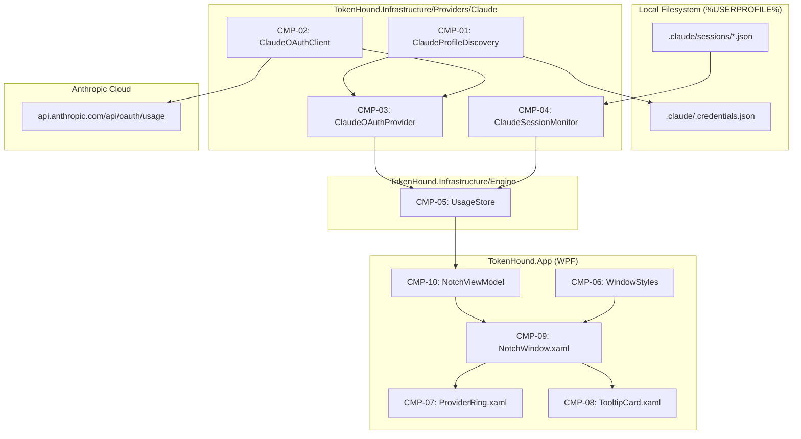

# TechSpec — Tracer Bullet: Minimal Notch HUD and Claude Code Provider

## Sources and traceability

- PRD: [tasks/prd-tracer-bullet-claude/prd.md](file:///D:/MyProjects/Ideas/TokenHound/tasks/prd-tracer-bullet-claude/prd.md)
- Architecture: [ARCHITECTURE.md](file:///D:/MyProjects/Ideas/TokenHound/ARCHITECTURE.md)
- Canonical Terminology: [CONTEXT.md](file:///D:/MyProjects/Ideas/TokenHound/CONTEXT.md)
- ADR: [docs/adr/0001-tracer-bullet-and-provider-swarm.md](file:///D:/MyProjects/Ideas/TokenHound/docs/adr/0001-tracer-bullet-and-provider-swarm.md)
- Specifications: [docs/specs/01-READING-STRATEGY-RESILIENCE.md](file:///D:/MyProjects/Ideas/TokenHound/docs/specs/01-READING-STRATEGY-RESILIENCE.md), [docs/specs/03-PROVIDER-CLAUDE-CODE.md](file:///D:/MyProjects/Ideas/TokenHound/docs/specs/03-PROVIDER-CLAUDE-CODE.md), [docs/specs/10-ARCHITECTURE-PROJECT-STRUCTURE.md](file:///D:/MyProjects/Ideas/TokenHound/docs/specs/10-ARCHITECTURE-PROJECT-STRUCTURE.md)

## Solution summary

This specification details the technical design of the TokenHound Tracer Bullet, establishing the complete vertical pipeline connecting presentation (`TokenHound.App`), central orchestration (`TokenHound.Infrastructure/Engine/UsageStore.cs`), and the Claude Code reference provider (`TokenHound.Infrastructure/Providers/Claude/`).

On the infrastructure side, `ClaudeProfileDiscovery` reads `%USERPROFILE%\.claude\.credentials.json` (using `SharedFileReader`), `ClaudeOAuthClient` queries `https://api.anthropic.com/api/oauth/usage` with the required `anthropic-beta: oauth-2025-04-20` header, and `ClaudeSessionMonitor` parses active session PID files with `ProcessLiveness` checks. On the presentation side, `TokenHound.App` initializes a floating WPF capsule (`NotchWindow.xaml`) configured with Win32 extended styles (`WS_EX_NOACTIVATE`, `WS_EX_TOOLWINDOW`, `WS_EX_TOPMOST`) via `HwndSource`, displaying the `ProviderRing` and `TooltipCard` controls bound to `NotchViewModel`.

## Technical decisions

| ID | PRD obligations | Decision | Reason and evidence | Alternatives and trade-offs |
| --- | --- | --- | --- | --- |
| DEC-01 | FR-01, NFR-04 | Implement `ClaudeProfileDiscovery` utilizing `SharedFileReader` to discover default and multi-profile credentials. | Prevents file-locking conflicts while Claude Code CLI writes or refreshes tokens; strictly reads tokens into ephemeral memory. | Direct `File.ReadAllText` (rejected: lacks non-locking `FileShare.ReadWrite \| FileShare.Delete`). |
| DEC-02 | FR-02, NFR-04 | Isolate Anthropic network interaction in `ClaudeOAuthClient` with typed DTO deserialization and `HttpClient`. | Decouples HTTP networking, header serialization, and error translation from domain snapshot mapping. | Monolithic provider adapter (rejected: impedes testing network logic in isolation). |
| DEC-03 | FR-03, OBJ-01 | Implement `ClaudeOAuthProvider` implementing `IUsageProvider`, mapping `five_hour` and `seven_day` payloads into immutable `Snapshot` records. | Standardizes Claude quota metrics into domain contracts; handles unauthenticated states by returning `ProviderStatus.NeedsAuth`. | Custom provider DTOs leaking into UI (rejected: violates Clean Architecture). |
| DEC-04 | FR-04, OBJ-03 | Implement `ClaudeSessionMonitor` implementing `IActivityMonitor`, validating PID presence and `StartTimeUtc` via `ProcessLiveness`. | Differentiates between dead session artifacts and live executing Claude CLI processes; guards against recycled PIDs. | Checking only file timestamps (rejected: stale session files remain after CLI crashes). |
| DEC-05 | FR-05 | Implement `UsageStore` in `TokenHound.Infrastructure/Engine/` coordinating registered providers and monitors with adaptive polling cadence. | Centralizes polling timers, power suspend/resume reactivity, and snapshot state broadcasting across all providers. | Polling inside each individual ViewModel (rejected: causes duplicate network calls and untracked timers). |
| DEC-06 | FR-06, NFR-01 | Inject Win32 extended styles `WS_EX_NOACTIVATE (0x08000000)`, `WS_EX_TOOLWINDOW (0x00000080)`, and `WS_EX_TOPMOST (0x00000008)` via `HwndSource` in `Window.SourceInitialized`. | Ensures the Notch HUD never steals focus from code editors or terminals during clicks, hovers, or timer ticks. | Standard WPF `Topmost="True"` alone (rejected: steals keyboard focus on window activation). |
| DEC-07 | FR-07, FR-08, FR-09 | Construct `NotchWindow`, `ProviderRing`, and `TooltipCard` as lightweight WPF XAML controls using pure vector paths and data bindings. | Guarantees sub-millisecond redraws, zero bitmap blur on high-DPI displays, and idle memory consumption under 45 MB. | WinUI 3 (rejected: high memory footprint ~90-160 MB and focus-stealing bugs). |
| DEC-08 | FR-10, OBJ-04 | Implement `NotchViewModel` with automatic fallback to `MockUsageProvider` when Claude credentials are not present. | Allows any developer or CI environment to run and visually inspect the HUD without requiring an active Claude subscription. | Crashing or showing empty screen when unauthenticated (rejected: poor developer experience). |

## Components and flow

| ID | Component | New or modified | Responsibility | Dependencies |
| --- | --- | --- | --- | --- |
| CMP-01 | `src/TokenHound.Infrastructure/Providers/Claude/ClaudeProfileDiscovery.cs` | New | Discovers `%USERPROFILE%\.claude\.credentials.json` and multi-profile directories. | `SharedFileReader` |
| CMP-02 | `src/TokenHound.Infrastructure/Providers/Claude/ClaudeOAuthClient.cs` | New | Executes HTTPS GET `/api/oauth/usage` with required beta headers. | `HttpClient`, `System.Text.Json` |
| CMP-03 | `src/TokenHound.Infrastructure/Providers/Claude/ClaudeOAuthProvider.cs` | New | Implements `IUsageProvider` for Claude Code. | CMP-01, CMP-02, `TokenHound.Core` |
| CMP-04 | `src/TokenHound.Infrastructure/Providers/Claude/ClaudeSessionMonitor.cs` | New | Implements `IActivityMonitor` scanning session files and validating PIDs. | `ProcessLiveness`, `SharedFileReader` |
| CMP-05 | `src/TokenHound.Infrastructure/Engine/UsageStore.cs` | New | Central coordinator managing polling schedule, state store, and event dispatch. | `TokenHound.Core`, `IUsageProvider`, `IActivityMonitor` |
| CMP-06 | `src/TokenHound.App/Interop/WindowStyles.cs` | New | P/Invoke wrapper for `GetWindowLongW`/`SetWindowLongW` applying `WS_EX_NOACTIVATE`. | `user32.dll` |
| CMP-07 | `src/TokenHound.App/UI/Controls/ProviderRing.xaml` / `.cs` | New | UserControl rendering circular utilization arc, badge, and color states. | WPF |
| CMP-08 | `src/TokenHound.App/UI/Controls/TooltipCard.xaml` / `.cs` | New | UserControl displaying detailed quotas, reset countdowns, and PID status. | WPF |
| CMP-09 | `src/TokenHound.App/UI/Windows/NotchWindow.xaml` / `.cs` | New | Floating, transparent, non-activating HUD capsule window. | CMP-06, CMP-07, CMP-08 |
| CMP-10 | `src/TokenHound.App/ViewModels/NotchViewModel.cs` | New | ViewModel binding `UsageStore` updates to WPF controls with Mock fallback. | CMP-05, `TokenHound.Core` |



## Contracts and data

### Anthropic Telemetry DTOs

```csharp
namespace TokenHound.Infrastructure.Providers.Claude;

public sealed record ClaudeUsageResponse
{
    public ClaudeWindowDto? FiveHour { get; init; }
    public ClaudeWindowDto? SevenDay { get; init; }
}

public sealed record ClaudeWindowDto
{
    public double Utilization { get; init; }
    public DateTimeOffset? ResetsAt { get; init; }
}

public sealed record ClaudeCredentialDto
{
    public string? AccessToken { get; init; }
    public DateTimeOffset? ExpiresAt { get; init; }
}
```

### Window Interop Styles

```csharp
namespace TokenHound.App.Interop;

public static class WindowStyles
{
    public const int GWL_EXSTYLE = -20;
    public const int WS_EX_NOACTIVATE = 0x08000000;
    public const int WS_EX_TOOLWINDOW = 0x00000080;
    public const int WS_EX_TOPMOST = 0x00000008;

    public static void EnableNonActivating(IntPtr hwnd);
}
```

## Integrations and interfaces

- **Anthropic OAuth API**: `GET https://api.anthropic.com/api/oauth/usage` with headers:
  - `Authorization: Bearer <accessToken>`
  - `anthropic-beta: oauth-2025-04-20`
  - `User-Agent: TokenHound/1.0`
- **Win32 User32.dll**: `GetWindowLongW` and `SetWindowLongW` targeting `GWL_EXSTYLE` on the window's `HwndSource`.
- **Operating System Desktop**: Screen primary work area bounds (`SystemParameters.WorkArea`) positioning capsule at `Top = WorkArea.Top`, `Left = WorkArea.Left + (WorkArea.Width - CapsuleWidth) / 2`.

## Errors, security, and recovery

- **Unauthenticated / Expired Tokens**: If `.credentials.json` is missing or the token has expired, `ClaudeOAuthProvider` returns `ProviderStatus.NeedsAuth` without throwing exceptions. The UI displays an amber/purple ring and tooltip text `"Run 'claude login' in terminal"`.
- **Rate Limit (HTTP 429)**: `ClaudeOAuthClient` captures HTTP 429, extracts `Retry-After` header, evaluates deadline via `RateLimitPolicy.CalculateDeadline`, and sets `Snapshot.Status = RateLimited` with active countdown.
- **Corrupted Session Files**: `ClaudeSessionMonitor` catches JSON parsing errors on individual session files and skips them without interrupting other sessions.
- **Token Protection**: Access tokens are held exclusively in volatile memory; never passed to ViewModels, logged, or serialized.

## Sequencing

| Step | Depends on | Verifiable result |
| --- | --- | --- |
| 1. Claude Profile & Credential Discovery (`CMP-01`) | PRD 01 | Unit tests verify parsing of `.credentials.json` and multi-profile paths. |
| 2. Claude OAuth Client (`CMP-02`) | PRD 01 | Unit tests verify HTTP request creation, beta headers, and JSON deserialization. |
| 3. Claude Provider Adapter (`CMP-03`) | Step 1, 2 | Returns valid `Snapshot` mapped to domain contracts. |
| 4. Claude Session Monitor (`CMP-04`) | PRD 01 | Accurately reports `Busy` when PID is active and `Idle` when no session is running. |
| 5. Central `UsageStore` Engine (`CMP-05`) | Step 3, 4 | Dispatches polling cycles and raises update events to subscribers. |
| 6. Win32 `WindowStyles` Interop (`CMP-06`) | — | Modifies HWND extended styles with `WS_EX_NOACTIVATE`. |
| 7. UI Controls: `ProviderRing` & `TooltipCard` (`CMP-07`, `CMP-08`) | — | Visual controls render arcs, colors, and formatted telemetry. |
| 8. `NotchViewModel` & Mock Fallback (`CMP-10`) | Step 5 | Connects `UsageStore` to UI with seamless fallback to `MockUsageProvider`. |
| 9. `NotchWindow` Integration (`CMP-09`) | Step 6, 7, 8 | Pinned capsule renders on screen without stealing window focus. |

## Test approach

- Profile: .NET 10 (`net10.0` for Infra/Core, `net10.0-windows` for App).
- E2E: `E2E: omitted by .NET desktop policy`.
- Unit tests with `MockHttpMessageHandler` and temporary files for provider components.
- Manual verification script for UI focus and visual geometry.

| ID | Obligations | Level | Scenario | Expected result | Command or project |
| --- | --- | --- | --- | --- | --- |
| TC-01 | FR-01 | Unit | Discover credentials in valid and missing paths | Returns token when valid; returns null when file missing | `rtk dotnet test tests/TokenHound.Infrastructure.Tests -- --filter-class "*ClaudeProfileDiscoveryTests*"` |
| TC-02 | FR-02 | Unit | Query usage endpoint with mock HTTP 200 payload | Parses `five_hour` and `seven_day` correctly; verifies beta header | `rtk dotnet test tests/TokenHound.Infrastructure.Tests -- --filter-class "*ClaudeOAuthClientTests*"` |
| TC-03 | FR-03 | Unit | Map API response to domain Snapshot | Yields `LimitWindow` records with exact utilization fractions and reset times | `rtk dotnet test tests/TokenHound.Infrastructure.Tests -- --filter-class "*ClaudeOAuthProviderTests*"` |
| TC-04 | FR-04 | Unit | Monitor active session with live and stale PID | Returns `Busy` for live PID; returns `Idle` for dead or recycled PID | `rtk dotnet test tests/TokenHound.Infrastructure.Tests -- --filter-class "*ClaudeSessionMonitorTests*"` |
| TC-05 | FR-05 | Unit | Run `UsageStore` refresh loop with registered provider | Updates snapshot cache and triggers change events | `rtk dotnet test tests/TokenHound.Infrastructure.Tests -- --filter-class "*UsageStoreTests*"` |
| TC-06 | FR-06 | Unit / Interop | Inspect `WindowStyles` bitmask manipulation | Extended styles include `WS_EX_NOACTIVATE` and `WS_EX_TOOLWINDOW` | `rtk dotnet test tests/TokenHound.App.Tests -- --filter-class "*WindowStylesTests*"` |
| TC-07 | FR-10 | Unit | Initialize `NotchViewModel` with mock fallback | Loads `MockUsageProvider` when Claude token is absent; exposes observable rings | `rtk dotnet test tests/TokenHound.App.Tests -- --filter-class "*NotchViewModelTests*"` |
| TC-08 | FR-06, OBJ-02 | Manual | Launch NotchWindow and click while typing in Notepad/Terminal | Window never steals focus; typing in active window continues uninterrupted | Manual verification script |

## Observability and rollout

- Signals: Structured logs from `UsageStore` logging cycle execution, provider status transitions, and backoff deadlines.
- Verification: Standalone startup of `TokenHound.App` displays floating capsule with mock data or live Claude metrics.

## Risks and open items

- Risk: Anthropic changes the beta header (`oauth-2025-04-20`) or JSON response structure.
  - Mitigation: `ClaudeOAuthClient` isolates headers in constants and deserializes with lenient options (`PropertyNameCaseInsensitive = true`).
- Open item: None.

## Relevant files

- Modify:
  - `src/TokenHound.App/TokenHound.App.csproj`
  - `src/TokenHound.App/App.xaml`
  - `src/TokenHound.App/App.xaml.cs`
- Create:
  - `src/TokenHound.Infrastructure/Providers/Claude/ClaudeProfileDiscovery.cs`
  - `src/TokenHound.Infrastructure/Providers/Claude/ClaudeOAuthClient.cs`
  - `src/TokenHound.Infrastructure/Providers/Claude/ClaudeOAuthProvider.cs`
  - `src/TokenHound.Infrastructure/Providers/Claude/ClaudeSessionMonitor.cs`
  - `src/TokenHound.Infrastructure/Engine/UsageStore.cs`
  - `src/TokenHound.App/Interop/WindowStyles.cs`
  - `src/TokenHound.App/UI/Controls/ProviderRing.xaml`
  - `src/TokenHound.App/UI/Controls/ProviderRing.xaml.cs`
  - `src/TokenHound.App/UI/Controls/TooltipCard.xaml`
  - `src/TokenHound.App/UI/Controls/TooltipCard.xaml.cs`
  - `src/TokenHound.App/UI/Windows/NotchWindow.xaml`
  - `src/TokenHound.App/UI/Windows/NotchWindow.xaml.cs`
  - `src/TokenHound.App/ViewModels/NotchViewModel.cs`
  - `tests/TokenHound.Infrastructure.Tests/Providers/ClaudeProfileDiscoveryTests.cs`
  - `tests/TokenHound.Infrastructure.Tests/Providers/ClaudeOAuthClientTests.cs`
  - `tests/TokenHound.Infrastructure.Tests/Providers/ClaudeOAuthProviderTests.cs`
  - `tests/TokenHound.Infrastructure.Tests/Providers/ClaudeSessionMonitorTests.cs`
  - `tests/TokenHound.Infrastructure.Tests/Engine/UsageStoreTests.cs`
