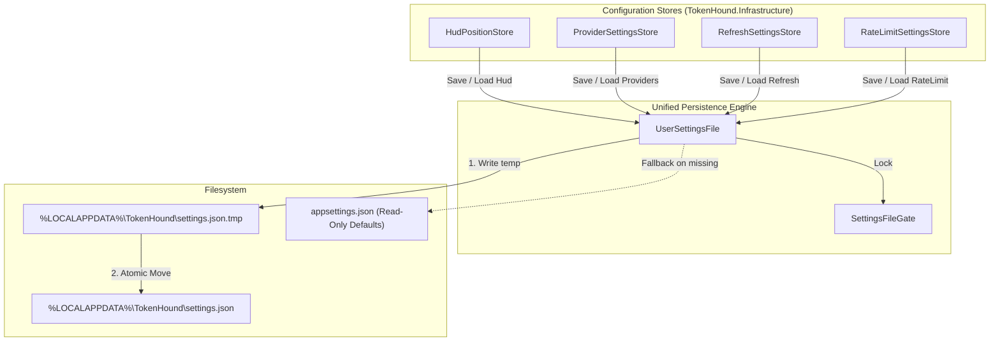

# TechSpec — User Settings Persistence in LocalAppData

## Sources and traceability

- PRD: [prd.md](file:///D:/MyProjects/TokenHound/tasks/prd-user-settings-persistence/prd.md)
- Repository constraints: [AGENTS.md](file:///D:/MyProjects/TokenHound/AGENTS.md) ("Persist configuration as JSON with System.Text.Json", Clean Architecture, Core purity).
- Architecture context: [ARCHITECTURE.md](file:///D:/MyProjects/TokenHound/ARCHITECTURE.md) (Local data folder conventions under `%LOCALAPPDATA%\TokenHound\`).
- Existing code:
  - [HudPositionStore.cs](file:///D:/MyProjects/TokenHound/src/TokenHound.Infrastructure/Configuration/HudPositionStore.cs)
  - [ProviderSettingsStore.cs](file:///D:/MyProjects/TokenHound/src/TokenHound.Infrastructure/Configuration/ProviderSettingsStore.cs)
  - [RefreshSettingsStore.cs](file:///D:/MyProjects/TokenHound/src/TokenHound.Infrastructure/Configuration/RefreshSettingsStore.cs)
  - [SettingsFileGate.cs](file:///D:/MyProjects/TokenHound/src/TokenHound.Infrastructure/Configuration/SettingsFileGate.cs)
  - [appsettings.json](file:///D:/MyProjects/TokenHound/src/TokenHound.App/appsettings.json)

## Solution summary

Migrate all mutable runtime settings (`Hud`, `Providers`, `Refresh`, and `RateLimit`) from the application base directory's `appsettings.json` to an isolated user configuration file at `%LOCALAPPDATA%\TokenHound\settings.json`.

`appsettings.json` remains strictly read-only, serving as factory defaults and Serilog logging configuration. Reading settings checks the user file first and falls back to `appsettings.json` for missing properties. Writing settings serializes a strongly typed `UserSettings` structure to a temporary file (`settings.json.tmp`) and executes an atomic file replace (`File.Move(tmp, target, overwrite: true)`), guaranteed by NTFS filesystem semantics and guarded by `SettingsFileGate`.

## Technical decisions

| ID | PRD obligations | Decision | Reason and evidence | Alternatives and trade-offs |
| --- | --- | --- | --- | --- |
| DEC-01 | FR-01, OBJ-01, US-01 | Store mutable user configuration at `%LOCALAPPDATA%\TokenHound\settings.json`. Allow path override via constructor for test isolation. | Standard Windows convention for user state. Prevents `UnauthorizedAccessException` when installed in `C:\Program Files\TokenHound`. | Storing in app directory fails in production; Windows Registry does not support structured JSON; SQLite violates `AGENTS.md`. |
| DEC-02 | FR-03, OBJ-02, NFR-03 | Implement atomic writes via temporary file `.tmp` + `File.Move(tmp, target, overwrite: true)`. | On NTFS, `File.Move` with `overwrite: true` replaces the target directory entry atomically. Eliminates 0-byte truncation on power loss or crash. | `File.WriteAllText` can truncate mid-write; `File.Replace` requires the target to already exist. |
| DEC-03 | FR-02, FR-05, OBJ-03, OBJ-04 | Provide automatic first-run migration from `appsettings.json` and read fallback. | Preserves existing customized HUD coordinates and provider states on upgrade without user intervention. `appsettings.json` stays immutable. | Requiring users to reconfigure settings on update degrades UX. |
| DEC-04 | FR-06, NFR-01, NFR-04 | Implement a unified `UserSettingsFile` managing `UserSettings` (strongly typed record) under `SettingsFileGate`. | Replaces brittle JSON DOM manipulation (`JsonNode`) with fast, typed `System.Text.Json` serialization. Serializes writers across threads. | Maintaining separate ad-hoc file writers across multiple stores causes file lock collisions and duplicated logic. |
| DEC-05 | FR-07, NFR-02 | Refactor `HudPositionStore`, `ProviderSettingsStore`, `RefreshSettingsStore`, and `RateLimitSettingsStore` as thin adapters over `UserSettingsFile`. | Keeps existing public store contracts unchanged for callers while unifying underlying storage and atomic guarantees. | Forcing all callers to change their dependency injection / instantiation breaks existing code across App and Infrastructure. |

## Components and flow



### Components inventory

| ID | Component | New or modified | Responsibility | Dependencies |
| --- | --- | --- | --- | --- |
| CMP-01 | `src/TokenHound.Infrastructure/Configuration/UserSettings.cs` | New | Strongly typed record containing `HudPositionSettings? Hud`, `ProviderSettings? Providers`, `RefreshSettings? Refresh`, `RateLimitSettings? RateLimit`. | None |
| CMP-02 | `src/TokenHound.Infrastructure/Configuration/UserSettingsFile.cs` | New | Resolves paths, performs atomic writes (`.tmp` -> `File.Move`), reads with fallback to defaults, and executes first-run migration. | CMP-01, `SettingsFileGate` |
| CMP-03 | `src/TokenHound.Infrastructure/Configuration/HudPositionStore.cs` | Modified | Adapts `Load` and `Save` to delegate to `UserSettingsFile`. | CMP-02 |
| CMP-04 | `src/TokenHound.Infrastructure/Configuration/ProviderSettingsStore.cs` | Modified | Adapts `Load` and `SaveAsync` to delegate to `UserSettingsFile`. | CMP-02 |
| CMP-05 | `src/TokenHound.Infrastructure/Configuration/RefreshSettingsStore.cs` | Modified | Adds `Save` / `SaveAsync` delegating to `UserSettingsFile`, preserving existing `Load` behavior. | CMP-02 |
| CMP-06 | `src/TokenHound.Infrastructure/Configuration/RateLimitSettings.cs` | New | Configuration record for 429 retry floor parameters (`MinimumRetryFloorSeconds`). | None |
| CMP-07 | `src/TokenHound.Infrastructure/Configuration/RateLimitSettingsStore.cs` | New | Reader and writer for rate limit configuration delegating to `UserSettingsFile`. | CMP-02, CMP-06 |

## Contracts and data

### UserSettings Record

```csharp
namespace TokenHound.Infrastructure.Configuration;

/// <summary>
/// Root model for user-configurable settings persisted in LocalAppData.
/// </summary>
public sealed record UserSettings
{
    /// <summary>Gets the HUD window placement settings.</summary>
    public HudPositionSettings? Hud { get; init; }

    /// <summary>Gets the provider enablement settings.</summary>
    public ProviderSettings? Providers { get; init; }

    /// <summary>Gets the periodic refresh schedule settings.</summary>
    public RefreshSettings? Refresh { get; init; }

    /// <summary>Gets the HTTP 429 rate limit resilience settings.</summary>
    public RateLimitSettings? RateLimit { get; init; }
}
```

### RateLimitSettings Record

```csharp
namespace TokenHound.Infrastructure.Configuration;

/// <summary>
/// Configuration for HTTP 429 rate-limit resilience parameters.
/// </summary>
public sealed record RateLimitSettings
{
    public const int MINIMUM_FLOOR_SECONDS = 60;
    public const int DEFAULT_FLOOR_SECONDS = 60;

    public int? MinimumRetryFloorSeconds { get; init; }

    public TimeSpan MinimumRetryFloor
        => TimeSpan.FromSeconds(Math.Max(MINIMUM_FLOOR_SECONDS, MinimumRetryFloorSeconds ?? DEFAULT_FLOOR_SECONDS));
}
```

### UserSettingsFile API

```csharp
namespace TokenHound.Infrastructure.Configuration;

public sealed class UserSettingsFile
{
    public static string DefaultUserSettingsPath { get; }
    public string UserSettingsPath { get; }
    public string DefaultsFilePath { get; }

    public UserSettingsFile(string? userSettingsPath = null, string? defaultsFilePath = null);

    public UserSettings Load();
    public Task<UserSettings> LoadAsync(CancellationToken cancellationToken = default);

    public bool Save(UserSettings settings);
    public Task<bool> SaveAsync(UserSettings settings, CancellationToken cancellationToken = default);

    public bool Update(Func<UserSettings, UserSettings> updateAction);
    public Task<bool> UpdateAsync(Func<UserSettings, UserSettings> updateAction, CancellationToken cancellationToken = default);
}
```

## Errors, security, and recovery

- **Permission Errors**: Writing to `%LOCALAPPDATA%\TokenHound\` succeeds for standard non-elevated user accounts on Windows.
- **Atomic Recovery**: If serialization fails or the process terminates during `Save`, the `.tmp` file is either deleted or overwritten on next save. The existing `settings.json` is never partially modified.
- **Missing Directory**: `UserSettingsFile` checks and creates the target directory (`Directory.CreateDirectory`) prior to writing.
- **Concurrency**: `SettingsFileGate` serializes all in-process read-modify-write updates. File streams use `FileShare.ReadWrite` to allow non-blocking concurrent readers.

## Sequencing

| Step | Depends on | Verifiable result |
| --- | --- | --- |
| 1. DTOs & Contracts | — | `UserSettings` and `RateLimitSettings` created and compiling cleanly. |
| 2. UserSettingsFile Engine | Step 1 | `UserSettingsFile` implemented with isolated unit tests proving atomic swap, defaults fallback, and migration. |
| 3. Store Adapters Refactoring | Step 2 | `HudPositionStore`, `ProviderSettingsStore`, `RefreshSettingsStore`, and `RateLimitSettingsStore` integrated and passing regression suites. |

## Test approach

- Profile: .NET 10.0 (`net10.0`), Microsoft.Testing.Platform runner with xUnit v3 in `tests/TokenHound.Infrastructure.Tests`.
- E2E: Omitted by desktop .NET policy.
- Test commands:
  ```powershell
  rtk dotnet run --project tests/TokenHound.Infrastructure.Tests/TokenHound.Infrastructure.Tests.csproj --no-build --no-restore -c Release -- --minimum-expected-tests 1 --filter-class "*UserSettingsFileTests*"
  rtk dotnet run --project tests/TokenHound.Infrastructure.Tests/TokenHound.Infrastructure.Tests.csproj --no-build --no-restore -c Release -- --minimum-expected-tests 1 --filter-class "*HudPositionStoreTests*"
  rtk dotnet run --project tests/TokenHound.Infrastructure.Tests/TokenHound.Infrastructure.Tests.csproj --no-build --no-restore -c Release -- --minimum-expected-tests 1 --filter-class "*ProviderSettingsStoreTests*"
  rtk dotnet run --project tests/TokenHound.Infrastructure.Tests/TokenHound.Infrastructure.Tests.csproj --no-build --no-restore -c Release -- --minimum-expected-tests 1 --filter-class "*RefreshSettingsStoreTests*"
  rtk dotnet run --project tests/TokenHound.Infrastructure.Tests/TokenHound.Infrastructure.Tests.csproj --no-build --no-restore -c Release -- --minimum-expected-tests 1 --filter-class "*RateLimitSettingsStoreTests*"
  ```

### Test matrix

| ID | Obligations | Level | Scenario | Expected result | Project / class |
| --- | --- | --- | --- | --- | --- |
| TC-01 | FR-01, FR-02 | Unit | Load when user settings file does not exist | Returns defaults from `appsettings.json` | `UserSettingsFileTests` |
| TC-02 | FR-03, NFR-03 | Unit | Atomic save with temp file replacement | Target file is updated atomically; no `.tmp` leftover | `UserSettingsFileTests` |
| TC-03 | FR-04 | Unit | Save when LocalAppData directory does not exist | Directory created automatically, file written | `UserSettingsFileTests` |
| TC-04 | FR-05 | Unit | First-run migration from customized `appsettings.json` | Customized coordinates and provider flags copied to user settings | `UserSettingsFileTests` |
| TC-05 | FR-06, NFR-04 | Unit | Concurrent sectional updates via `UpdateAsync` | All sections safely merged without data loss | `UserSettingsFileTests` |
| TC-06 | FR-07 | Unit | `HudPositionStore` save and load via new engine | Placement saved and reloaded accurately | `HudPositionStoreTests` |
| TC-07 | FR-07 | Unit | `ProviderSettingsStore` save and load via new engine | Enablement states saved and reloaded accurately | `ProviderSettingsStoreTests` |
| TC-08 | FR-07 | Unit | `RefreshSettingsStore` save and load | Refresh intervals saved and reloaded accurately | `RefreshSettingsStoreTests` |
| TC-09 | FR-07 | Unit | `RateLimitSettingsStore` save and load | Retry floor saved and reloaded with 60s clamp | `RateLimitSettingsStoreTests` |

## Observability and rollout

- Signals: Serilog warning log on IO error or failed migration.
- Migration: Automatic on first launch; no manual user intervention required.
- Rollback: Reverting binary still allows reading `appsettings.json` defaults.

## Risks and open items

- Risk: User has custom permissions on `%LOCALAPPDATA%`.
  - Mitigation: Handled with try/catch logging and graceful fallback to in-memory defaults.
- Open items: None.

## Relevant files

- Create:
  - `src/TokenHound.Infrastructure/Configuration/UserSettings.cs`
  - `src/TokenHound.Infrastructure/Configuration/UserSettingsFile.cs`
  - `src/TokenHound.Infrastructure/Configuration/RateLimitSettings.cs`
  - `src/TokenHound.Infrastructure/Configuration/RateLimitSettingsStore.cs`
  - `tests/TokenHound.Infrastructure.Tests/Configuration/UserSettingsFileTests.cs`
  - `tests/TokenHound.Infrastructure.Tests/Configuration/RateLimitSettingsStoreTests.cs`
- Modify:
  - `src/TokenHound.Infrastructure/Configuration/HudPositionStore.cs`
  - `src/TokenHound.Infrastructure/Configuration/ProviderSettingsStore.cs`
  - `src/TokenHound.Infrastructure/Configuration/RefreshSettingsStore.cs`
  - `tests/TokenHound.Infrastructure.Tests/Configuration/HudPositionStoreTests.cs`
  - `tests/TokenHound.Infrastructure.Tests/Configuration/ProviderSettingsStoreTests.cs`
  - `tests/TokenHound.Infrastructure.Tests/Configuration/RefreshSettingsStoreTests.cs`
